## 要約（Summary）

- **童顔効果**：童顔の人は「無実」「脅威ではない」と見なされやすく、刑事司法でも過失を小さく扱われる
- 童顔が権力獲得に有利か不利かは**人種によって逆転する**：白人が優位な社会では、童顔は黒人に有利、白人には不利
- これは、内集団・外集団バイアスと童顔効果が**複雑に相互作用する**ことを示す

## 本文（Body）

### 背景・問題意識

人間は、他者の顔つきから瞬時に「脅威かどうか」「信頼できるかどうか」を判断する。この判断は、**童顔（Babyface）**という特性に強く影響される。

童顔の人は、一般に「無実」「無害」と見なされやすい。しかし、この効果は**人種によって異なる**ことが研究で明らかになっている。

### アイデア・主張

#### 童顔効果の基本

童顔の人は、以下のような認識を受けやすい：

- **無実・無害**：刑事司法では、童顔の被告人は過失が小さいと見なされる
- **脅威ではない**：童顔の人は、大人らしい顔つきの人よりも攻撃的でないと認識される

この効果は、「子ども = 保護すべき存在」という本能的な認識に由来する。

#### 人種による童顔効果の逆転

研究によれば、童顔効果は**人種によって逆の影響**を与える：

##### 黒人の場合（白人が優位な社会）

- **童顔の黒人は権力を獲得しやすい**
- 理由：白人は黒人を「脅威」と見なしがちだが、**童顔の黒人は脅威に見えにくい**
- 結果として、童顔の黒人は、大人らしい顔の黒人よりも出世しやすい

##### 白人の場合（白人が優位な社会）

- **童顔の白人は権力を獲得しにくい**
- 理由：白人はそもそも脅威と見なされにくいため、童顔は「軟弱」という印象を与える
- 結果として、童顔の白人CEOは、大人らしい顔の白人CEOよりも評価が低い

#### 内集団・外集団バイアスとの相互作用

この現象は、以下の2つのバイアスが組み合わさった結果である：

1. **内集団・外集団バイアス**：白人は黒人を「外集団」として脅威と見なす
2. **童顔効果**：童顔は「脅威ではない」というシグナル

結果：

- 外集団（黒人）に対しては、童顔が「脅威の軽減」として機能し、有利に働く
- 内集団（白人）に対しては、童顔が「軟弱さ」として機能し、不利に働く

### 内容を視覚化するMermaid図

```mermaid
graph TD
    A["童顔"] --> B["基本的な認識"]
    B --> C["無実・無害"]
    B --> D["脅威ではない"]

    E["白人が優位な社会"] --> F["黒人に対する認識"]
    E --> G["白人に対する認識"]

    F --> H["外集団<br/>脅威と見なされがち"]

    H --> I["童顔の黒人"]
    H --> J["大人顔の黒人"]

    I --> K["脅威が軽減<br/>権力を獲得しやすい"]
    J --> L["脅威が強い<br/>権力を獲得しにくい"]

    G --> M["内集団<br/>脅威と見なされない"]

    M --> N["童顔の白人"]
    M --> O["大人顔の白人"]

    N --> P["軟弱に見える<br/>権力を獲得しにくい"]
    O --> Q["リーダーらしい<br/>権力を獲得しやすい"]

    style K fill:#ccffcc
    style L fill:#ffcccc
    style P fill:#ffcccc
    style Q fill:#ccffcc
```

### 具体例・ケース

**刑事司法での童顔効果**：
- 判事と陪審員は、童顔の被告人を「無実」と見なしやすい
- 同じ年齢でも、童顔の被告人は過失が小さいと判断される

**企業経営での童顔効果**：
- 童顔の白人CEOは「軟弱」という印象を与え、評価が低い
- しかし、童顔の黒人は白人社会で「脅威ではない」と見なされ、出世しやすい

**歴史的事例**：
- バラク・オバマ（比較的童顔）は、白人有権者から「親しみやすい」「脅威ではない」と認識され、選挙で有利だった可能性
- 一方、童顔の白人政治家は「強いリーダーシップ」を示しにくく、選挙で不利

### 反論・限界・条件

- **すべての状況で当てはまるわけではない**：童顔効果の程度は、文化や地域によって異なる
- **他の要因との相互作用**：身長、性別、年齢などが童顔効果に影響する
- **不合理で恐ろしい**：この現象は、人種的偏見を募らせる不合理なメカニズムである
- **教育と制度設計で緩和可能**：匿名評価や多様性の促進で、偏見を減らせる

## 関連ノート（Links）

- [[20251226093715-ingroup-outgroup-bias-cooperation|内集団・外集団バイアスと協力行動]] - 童顔効果が人種によって異なる理由
- [[20251226093545-gender-bias-leader-evaluation|ジェンダーバイアスとリーダー評価の歪み]] - 複数のバイアスが交差する問題
- [[20251226093115-evolutionary-mismatch-leadership|進化的ミスマッチとリーダーシップ選択]] - 童顔効果の進化的背景
- [[20251226092824-honest-signaling-theory-cost|シグナリング理論における正直なシグナルとコスト]] - 童顔は「脅威ではない」シグナル
- [[20251223234018-system-design-prevent-power-corruption|権力腐敗を防ぐシステム設計の3要素：選抜・責任・監視]] - 偏見を減らす制度設計

## To-Do / 次に考えること

- [ ] 自社の採用・昇進プロセスで、顔つきや外見が無意識に影響していないか評価
- [ ] 評価者に対して、童顔効果や人種的偏見についての教育を実施
- [ ] 面接時に写真を使わない、または評価時に外見を考慮しない仕組みを導入
- [ ] 多様性のある評価委員会を設置し、単一の視点からの偏見を減らす
