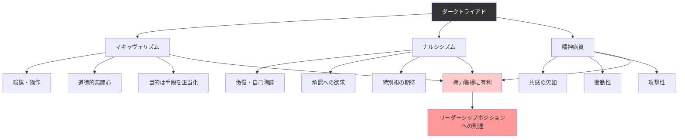

## 要約（Summary）

- ダークトライアドは、マキャヴェリズム、ナルシシズム、精神病質の3つの暗黒性格特性からなる心理学的概念
- これらの特性は連続的に存在し、誰もが程度の差こそあれ持っている可能性がある
- 「汚い12」と呼ばれる簡潔な12問の質問紙で測定可能であり、権力獲得との関連が実証されている

## 本文（Body）

### 背景・問題意識

なぜ一部の人々は他者を操作し、共感を欠き、自己中心的な行動を取りながらも、社会的成功を収めるのか？心理学者たちは、権力を握りやすい人々に共通する3つの性格特性を特定し、これを「ダークトライアド」と名付けた。

この概念は、単に「悪い人」を分類するためのものではない。むしろ、誰もが持ちうる特性の組み合わせであり、その程度が問題となる。

### アイデア・主張

ダークトライアドは、以下の3つの性格特性から構成される：

#### 1. マキャヴェリズム（Machiavellianism）

- **由来**：イタリアの政治哲学者ニッコロ・マキャヴェリの「目的は手段を正当化する」という思想
- **特徴**：
  - 陰謀や策略の使用
  - 対人操作の巧みさ
  - 他者への道徳的無関心
  - 戦略的思考と冷徹な判断
- **本質**：倫理よりも効率と結果を優先する

#### 2. ナルシシズム（Narcissism）

- **由来**：ギリシア神話のナルキッソス（自分の姿に恋して破滅した美青年）
- **特徴**：
  - 傲慢さと自己陶酔
  - 誇大な自己評価
  - 他者からの承認や賞賛への強い欲求
  - 特別扱いされるべきだという期待
- **本質**：自己を過大評価し、他者を自己の延長として扱う

#### 3. 精神病質（Psychopathy）

- **特徴**：
  - 共感能力の欠如
  - 衝動性と向こう見ずさ
  - 攻撃性
  - 他者を操作する傾向
  - 罪悪感や後悔の欠如
- **本質**：他者の苦痛に対する情動的反応が欠如している

### 測定方法：「汚い12」

2010年に研究者たちは、たった12問の質問で従来の長大な質問紙と同等の測定結果が得られることを発見した。これは「汚い12（Dirty Dozen）」として知られ、ダークトライアドの測定を簡便化した。

この簡潔さにより、企業や組織でのスクリーニングが容易になったが、同時に倫理的な問題も提起している。

### 内容を視覚化するMermaid図

### 具体例・ケース

**企業のCEO**：
- マキャヴェリズム：競合他社を出し抜くための戦略的操作、社内政治での巧みな立ち回り
- ナルシシズム：メディアへの露出を好み、自社の成功を自分の手柄として語る
- 精神病質：リストラを実行する際に感情的動揺を見せず、「ビジネス上の判断」として正当化

**政治家**：
- マキャヴェリズム：政敵を排除するための裏工作、有権者への約束を戦略的に反故
- ナルシシズム：自己のカリスマ性を強調、支持者からの賞賛を糧とする
- 精神病質：政策の犠牲者への共感を示さず、「大局的判断」として正当化

**日常レベルでの存在**：
- これらの特性は程度の差こそあれ、誰もが持っている
- 自己アピールが上手い同僚（軽度のナルシシズム）
- 期限に追われて他人の都合を無視する行動（一時的なマキャヴェリズム）
- 問題の深刻さを軽視して衝動的に決断（軽度の精神病質的傾向）

### 反論・限界・条件

**連続的特性であることの重要性**：
- ダークトライアドは二値的（ある/なし）ではなく、連続的に存在する
- 軽度の特性は、場面によっては適応的である可能性もある（例：交渉術、リスクテイク）

**測定の主観性**：
- 心理学的プロファイリングには測定誤差がある
- 自己申告式の質問紙は、社会的望ましさバイアスの影響を受ける

**文化的差異**：
- 西洋文化を前提とした概念であり、集団主義的文化では異なる評価基準が必要かもしれない

**病理化のリスク**：
- ダークトライアドという「ラベル」が、人々をステレオタイプ化するリスクがある
- 特性があること自体が問題ではなく、それをどう行使するかが重要

## 関連ノート（Links）

- [[20251227031853-psychopath-empathy-switch|サイコパスの共感能力の意図的制御]] - 精神病質の特性の詳細メカニズム
- [[20251227031854-dark-triad-hiring-advantage|採用プロセスにおけるダークトライアドの優位性]] - ダークトライアドが権力を獲得する具体的経路
- [[20251223233758-power-seeking-self-selection-bias|権力への自己選択バイアス：不適切な人がリーダーになる構造]] - ダークトライアドが権力を求める理由
- [[20251223233911-power-corrupts-mechanism|権力による腐敗メカニズム：権力が人の共感と行動を変える理由]] - 権力獲得後の変化
- [[20251226093115-evolutionary-mismatch-leadership|進化的ミスマッチとリーダーシップ選択]] - なぜダークトライアドが選ばれてしまうのか

## To-Do / 次に考えること

- [ ] 自社の採用・昇進プロセスで、ダークトライアドを持つ人が有利になる構造的欠陥がないか分析
- [ ] リーダー候補者の評価に、多面評価や行動観察を取り入れる方法を検討
- [ ] 自分自身のダークトライアド傾向を自己評価し、過度な傾向がないか確認
