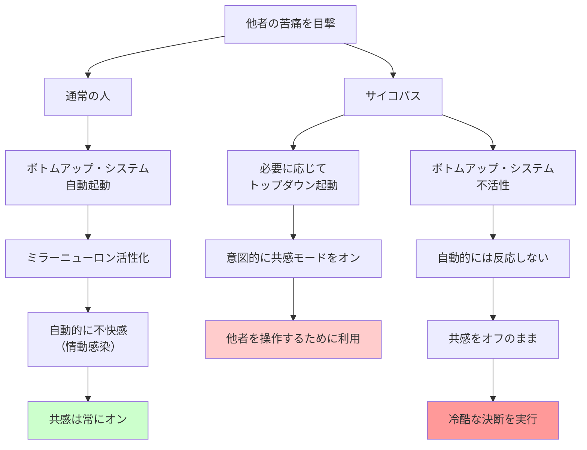

## 要約（Summary）

- サイコパスは共感を自然には感じないが、**意図的にオン/オフできる能力**を持つ
- 通常の人は自動的に共感するが、サイコパスは必要に応じて「共感モード」を起動できる
- この能力により、他者を操作する際には共感を利用し、冷酷な決断をする際には共感を切ることができる

## 本文（Body）

### 背景・問題意識

従来、サイコパスは「共感能力が欠如している」と考えられてきた。しかし、神経科学者ガッツォーラとキーザーズの研究により、驚くべき事実が明らかになった：サイコパスは共感を**感じることができる**が、通常の人とは**異なる方法で機能**している。

この発見は、サイコパスがなぜ表面的には魅力的で共感的に見えるのに、同時に冷酷な行動を取れるのかを説明する。

### アイデア・主張

#### 共感の2つのシステム

神経科学によると、共感は2つのシステムを通じて機能する：

1. **ボトムアップ（自動的）システム**：
   - ミラーニューロン・システムに基づく
   - 他者の感情を自動的に「鏡のように反映」する
   - 情動感染（幸せな人を見ると幸せになる、悲しい人を見ると悲しくなる）の基盤

2. **トップダウン（意図的）システム**：
   - 「心の理論」（メンタライジング）に基づく
   - 他者が何を感じているか、どんな意図を持っているかを**意図的に理解**しようとする

#### 通常の人 vs サイコパス

**通常の人**：
- 苦痛を見ると自動的に不快感を覚える（ボトムアップ・システムが自動起動）
- 共感は**デフォルトでオン**

**サイコパス**：
- 苦痛を見ても自動的には反応しない（ボトムアップ・システムが不活性）
- しかし、**意図的に共感モードをオンにできる**（トップダウン・システムは機能する）
- 共感は**必要に応じてオン**

#### 「標的化された武器」としての情動

サイコパスは、共感を**戦略的ツール**として使う：

- **オンにする場合**：他者を操作し、信頼を得て、望む結果を引き出す
- **オフにする場合**：冷酷な決断を下し、他者を犠牲にしても罪悪感を感じない

これにより、サイコパスは「共感的に見える瞬間」と「冷酷な行動」を自在に切り替えられる。

### 内容を視覚化するMermaid図

### 具体例・ケース

**ビジネス場面での使い分け**：
- **オン**：クライアントとの商談で「あなたの苦労はよくわかります」と共感を示し、信頼を獲得
- **オフ**：従業員をリストラする際、個人的な事情を一切考慮せず「ビジネス上の判断」として実行

**犯罪者のケース**：
- **オン**：被害者を安心させるために、親切で共感的な態度を装う
- **オフ**：犯行時には被害者の苦痛に対して何も感じない

**政治家の例**：
- **オン**：有権者の前で「皆さんの痛みを理解しています」と涙を流す
- **オフ**：政策決定時には、犠牲者の苦しみを無視して「大局的判断」を下す

**日常的なマニピュレーション**：
- 職場で同僚に共感を示して信頼を得た後、その情報を利用して出し抜く
- 恋愛関係で相手の感情を理解しているように振る舞いながら、実際には自分の利益のために操作している

### 反論・限界・条件

**すべてのサイコパスが同じではない**：
- 精神病質は連続的な特性であり、共感スイッチの制御能力にも個人差がある

**脳刺激技術による検証**：
- 研究者は、正常な人の共感を一時的に下げることにも成功している
- これは、共感が脳の特定領域の活動に依存していることを示す

**倫理的懸念**：
- この知見は、サイコパスを「特殊能力を持つ存在」として美化するリスクがある
- 実際には、この能力は他者を傷つけるために使われることが多い

**治療の可能性**：
- 共感を「オンにできる」という事実は、トレーニングや介入の可能性を示唆している
- しかし、本人に動機がない限り、効果は限定的

## 関連ノート（Links）

- [[20251227031852-dark-triad-three-personality-traits|ダークトライアド：権力を握る3つの暗黒特性]] - サイコパスが含まれるダークトライアドの全体像
- [[20251227031856-psychopath-unfairness-perception|サイコパスの不公平性認知：道徳ではなく侮辱として反応]] - 脳活動の違いがもたらす認知の歪み
- [[20251223233911-power-corrupts-mechanism|権力による腐敗メカニズム：権力が人の共感と行動を変える理由]] - 権力が共感を低下させるメカニズム（通常の人でも起こる）
- [[20251227031854-dark-triad-hiring-advantage|採用プロセスにおけるダークトライアドの優位性]] - 共感スイッチが採用面接で有利に働く
- [[20251227031857-psychopath-leadership-paradox|サイコパスのリーダーシップ・パラドックス]] - 権力獲得は得意だが、実際の成果は劣る

## To-Do / 次に考えること

- [ ] 職場や日常生活で「共感的に見えるが行動が伴わない人」を観察し、パターンを分析
- [ ] 自分自身が他者への共感を意図的にオフにしている瞬間がないか自己点検
- [ ] リーダー評価において、表面的な共感ではなく、実際の行動（部下への配慮、倫理的判断）を重視する基準を検討
