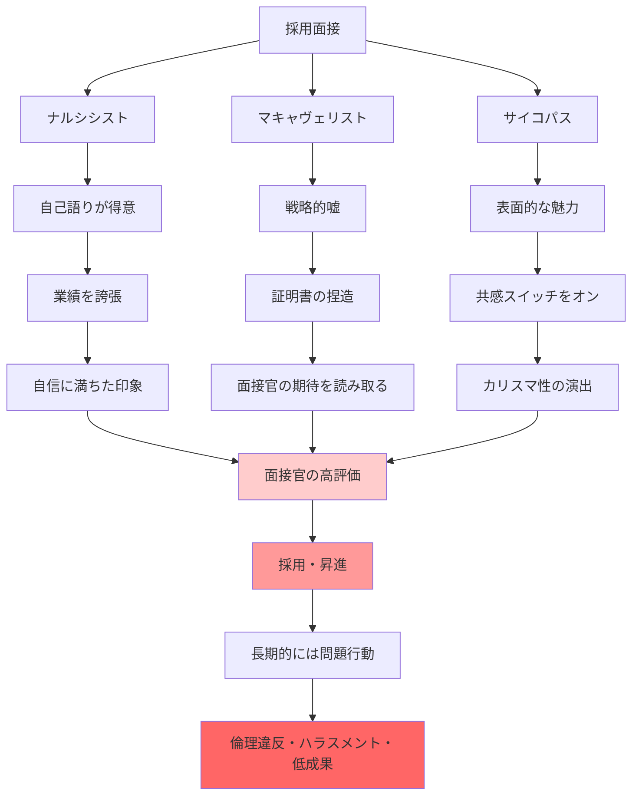

## 要約（Summary）

- 標準的な採用面接は、ダークトライアド特性を持つ人にとって**理想的なフォーマット**である
- 彼らは自己アピール、戦略的な嘘、表面的な魅力の演出が得意で、これらが面接で高評価される
- 私たちの雇用の仕方そのものが、不適切な人材を選抜する構造的欠陥を持っている

## 本文（Body）

### 背景・問題意識

なぜ「共感に欠け、他者を操作する人」が採用面接を通過し、昇進していくのか？ブライアン・クラースは、**採用プロセス自体がダークトライアドに有利**だと指摘する。

面接という短時間の自己アピールの場は、表面的な魅力とカリスマ性を演出できる人に有利であり、長期的な誠実さや倫理性を評価するには不十分である。

### アイデア・主張

#### 面接がダークトライアドに有利な理由

**1. 自己語りの場**：
- ナルシシストは自分について語るのが**大好き**
- 自己の業績を誇張し、魅力的なストーリーとして語る能力に長けている
- 面接官は、この「自信に満ちた語り」を能力の証と誤認しやすい

**2. 戦略的操作の場**：
- マキャヴェリストは「目的は手段を正当化する」と考えるため、嘘や証明書の捏造をためらわない
- 面接官が何を求めているかを素早く読み取り、それに合わせた回答を用意する

**3. 表面的な魅力の演出**：
- サイコパスは、表面的な魅力とカリスマ性を目立たせる天賦の才を持つ
- 共感スイッチを「オン」にして、面接官に好印象を与える
- 短時間の面接では、この演技を見抜くことは困難

#### 研究が示す証拠

**マキャヴェリストの行動**：
- マキャヴェリズムの傾向が強い人は、採用面接でより多くの話をでっち上げ、誇張し、嘘をつく

**サイコパスの適応能力**：
- サイコパスは、受けている面接の種類に**合わせて**話をでっち上げる
- 構造化面接でも非構造化面接でも、それぞれに最適化された戦略を取る

**ダークトライアドのキャリア成果**：
- ナルシシストは**収入が多い**
- マキャヴェリストは**社内で出世するのが上手**
- 精神病質が強い人は、**短期的には不利**だが、ある閾値を超えると権力を握る

#### 雇用システムの構造的欠陥

標準的な採用プロセスは、以下の要素で構成されるが、すべてがダークトライアドに有利：

1. **履歴書のスクリーニング**：誇張や捏造が見抜かれにくい
2. **面接**：表面的な魅力と自己アピールが評価される
3. **推薦状**：マキャヴェリストは推薦者を操作したり、捏造したりできる
4. **短期的な試用期間**：サイコパスは短期的には魅力的に振る舞える

このシステムは、**長期的な誠実さや倫理性を評価する仕組みを欠いている**。

### 内容を視覚化するMermaid図

### 具体例・ケース

**ナルシシストの面接**：
- 「私がプロジェクトをリードして、売上を200%増加させました」（実際にはチームの成果）
- 面接官は、この自信に満ちた語りに好印象を持つ
- 謙虚で正直な候補者（「チームで協力して達成しました」）は、相対的に印象が薄い

**マキャヴェリストの戦略**：
- 面接前に会社の価値観やミッションステートメントを調べ、それに合致する「作られたストーリー」を準備
- 推薦状を友人に依頼して書いてもらう、または自分で書いて署名だけもらう

**サイコパスのカリスマ性**：
- 面接中は笑顔で共感的な態度を示し、面接官に「この人なら一緒に働きたい」と思わせる
- 採用後、徐々に本性を現し、部下を操作・支配する

**実際の企業事例**：
- カリスマ的なCEOが採用されたが、数年後に倫理違反や不正会計が発覚
- 採用時の面接では「ビジョンを持った情熱的なリーダー」と評価されていた

### 反論・限界・条件

**すべての魅力的な候補者がサイコパスではない**：
- 自信があり、自己アピールが上手い人の中には、誠実で有能な人も多い
- 表面的な魅力だけで判断するのは危険

**構造化面接で緩和可能**：
- 行動面接（過去の具体的な行動を問う）は、作り話を見抜きやすい
- 複数の面接官による評価は、一人の面接官の偏見を減らせる

**リファレンスチェックの重要性**：
- 実際の推薦者に直接連絡を取り、候補者の行動や実績を確認する
- ただし、マキャヴェリストは推薦者を操作している可能性がある

**試用期間と360度評価**：
- 採用後の試用期間中に、上司だけでなく同僚・部下からも評価を集める
- サイコパスは部下への態度と上司への態度が異なるため、多面評価が有効

## 関連ノート（Links）

- [[20251227031852-dark-triad-three-personality-traits|ダークトライアド：権力を握る3つの暗黒特性]] - ダークトライアドの定義と特徴
- [[20251227031853-psychopath-empathy-switch|サイコパスの共感スイッチ：意図的にオン/オフ可能な共感能力]] - 面接で共感を演出する仕組み
- [[20251223233758-power-seeking-self-selection-bias|権力への自己選択バイアス：不適切な人がリーダーになる構造]] - ダークトライアドが権力を求める理由
- [[20251226083422-proactive-recruitment-power-positions|権力職への積極的採用：自己選択バイアスへの対策]] - 採用プロセスの改善策
- [[20251227031855-corporate-psychopath-prevalence|企業幹部層でのサイコパス高率現象]] - 採用プロセスの欠陥がもたらす結果

## To-Do / 次に考えること

- [ ] 自社の採用プロセスで、表面的な魅力や自己アピールが過度に評価されていないか分析
- [ ] 構造化面接（行動面接、ケース面接）の導入を検討
- [ ] 採用後の試用期間中に、360度評価を実施する仕組みを構築
- [ ] リファレンスチェックを形式的なものではなく、実質的な調査として強化
