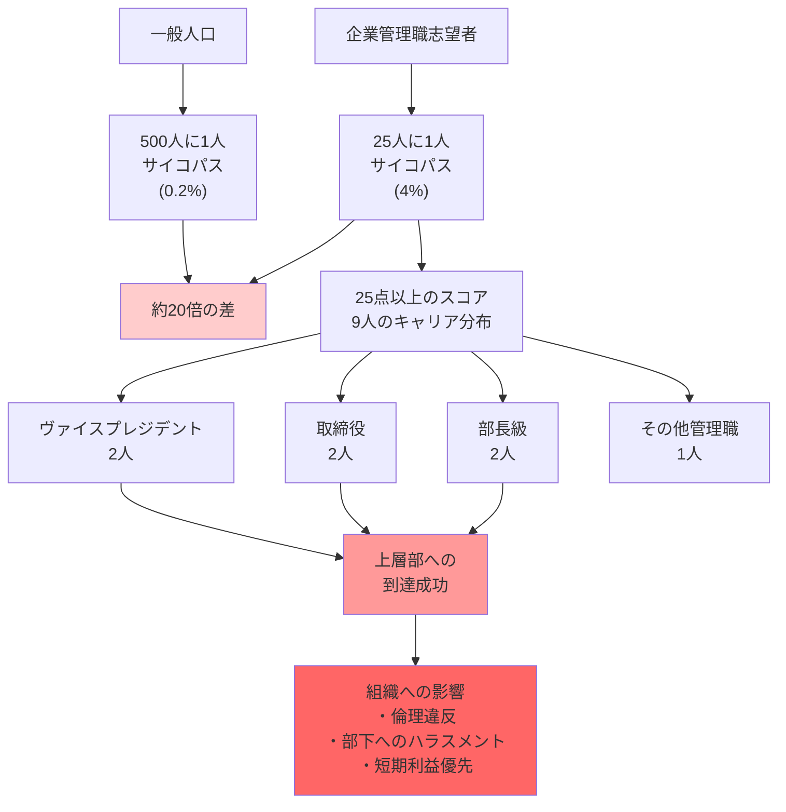

## 要約（Summary）

- 一般人口ではサイコパスは約500人に1人だが、企業管理職では25人に1人と**約20倍**の高率
- サイコパスの幹部のうち、2/9がヴァイスプレジデント以上の高位に就いている
- サイコパスは権力を求めるだけでなく、実際に上層部に到達することに成功している

## 本文（Body）

### 背景・問題意識

サイコパスは稀な存在（一般人口の0.2%程度）だが、なぜ企業の幹部や政治のリーダーには、不相応なまでに多く見られるのか？

この疑問に答えるため、研究者たちは企業の管理職志望者を対象に精神病質を測定した。結果は衝撃的だった：サイコパスの割合が一般人口の**5倍から20倍**にも達していた。

### アイデア・主張

#### 精神病質の測定：PCL-R

精神病質は、「ヘア・サイコパシー・チェックリスト改訂版（PCL-R）」で測定される：

- **スコア範囲**：0〜40点
- **サイコパスの閾値**：30点以上
- **一般人口**：500人に約1人が30点を超える（約0.2%）
- **一部の研究**：100人に1人（1%）という結果もあり

#### 企業管理職での驚異的な高率

企業の管理職志望者を対象とした調査では：

- **25人に1人**（4%）が30点を超える
- これは一般人口の**約20倍**（0.2%の場合）
- 他の研究では**5倍**（1%の場合）

さらに重要なのは、**25点以上のスコアを持つ9人のうち**：

- **2人がヴァイスプレジデント**
- **2人が取締役**
- **2人が部長またはそれに匹敵する地位**
- **1人がその他の管理職**

つまり、サイコパスは単に管理職を目指しているだけでなく、**すでに上層部に到達している**。

#### なぜサイコパスは上層部に到達するのか

1. **権力への強い欲求**：
   - サイコパスは権力を求める傾向が強い
   - 一般の人々よりも積極的に管理職や幹部ポジションを目指す

2. **採用・昇進プロセスでの優位性**：
   - 表面的な魅力とカリスマ性
   - 自己アピールと戦略的操作の巧みさ
   - 共感スイッチをオンにして面接官を魅了

3. **昇進のための非倫理的行動**：
   - 他者を犠牲にしても罪悪感を感じない
   - ライバルを蹴落とす、功績を横取りする、などの行動をためらわない

4. **リスクの無視**：
   - 普通の人が躊躇するような危険な決断を大胆に下す
   - 短期的には「決断力がある」と評価される

### 内容を視覚化するMermaid図

### 具体例・ケース

**エンロン事件**：
- エンロンのCEOや幹部たちは、カリスマ的で自信に満ちていると評価されていた
- しかし、実際には不正会計と従業員・株主への欺瞞を繰り返していた
- 事後分析では、経営陣の多くがダークトライアド特性を持っていたと指摘される

**ウェルズ・ファーゴ不正口座開設スキャンダル**：
- 幹部は従業員に過酷なノルマを課し、不正行為を黙認
- 従業員が苦しんでいることへの共感を示さず、「結果が全て」と主張
- 倫理違反が発覚後も、自己の責任を認めず他者のせいにした

**日常的な企業での観察**：
- 部下に対して威圧的で、上司には魅力的に振る舞う幹部
- 功績を独り占めし、失敗は部下のせいにする
- リストラを実行する際に何の感情も示さない

**政治リーダー**：
- 独裁者の多くが、高いサイコパシー・スコアを持つと推測される
- カリスマ性で権力を獲得し、その後は冷酷な支配を行う

### 反論・限界・条件

**すべての幹部がサイコパスではない**：
- 4%という数字は、96%の幹部は**サイコパスではない**ことを意味する
- 誠実で有能なリーダーも多数存在する

**サンプルサイズと方法論**：
- 一部の研究はサンプルサイズが小さく、一般化には注意が必要
- PCL-Rの測定には専門家の評価が必要で、自己申告では不正確

**文化的・業界的差異**：
- 業界によってサイコパスの割合は異なる可能性（金融、営業などは高い可能性）
- 協調を重視する文化では、サイコパスは昇進しにくい

**因果関係の複雑さ**：
- 権力がサイコパス的特性を**引き起こす**可能性もある（権力による腐敗）
- 元々のサイコパス特性と、権力獲得後の変化を区別する必要がある

## 関連ノート（Links）

- [[20251227031852-dark-triad-three-personality-traits|ダークトライアド：権力を握る3つの暗黒特性]] - サイコパスが含まれるダークトライアドの全体像
- [[20251227031854-dark-triad-hiring-advantage|採用プロセスにおけるダークトライアドの優位性]] - なぜサイコパスが採用・昇進で有利なのか
- [[20251223233758-power-seeking-self-selection-bias|権力への自己選択バイアス：不適切な人がリーダーになる構造]] - サイコパスが権力を求める理由
- [[20251227031857-psychopath-leadership-paradox|サイコパスのリーダーシップ・パラドックス]] - 権力獲得後の実際の成果
- [[20251223234018-system-design-prevent-power-corruption|権力腐敗を防ぐシステム設計の3要素：選抜・責任・監視]] - この問題への対策

## To-Do / 次に考えること

- [ ] 自社の幹部層に、サイコパス的特性を持つ人がいないか観察（部下への態度、倫理的判断など）
- [ ] 昇進プロセスで、表面的な魅力やカリスマ性が過度に評価されていないか分析
- [ ] 360度評価や倫理審査など、サイコパス的行動を早期に発見する仕組みを検討
- [ ] 幹部候補者のバックグラウンドチェックを強化（過去の職場での評判、倫理的問題など）
