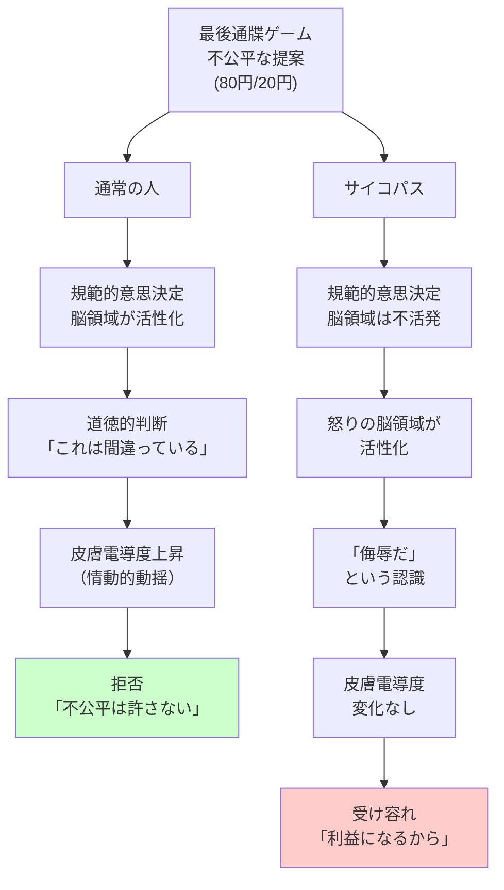

## 要約（Summary）

- 最後通牒ゲームにおいて、通常の人は不公平な提案を**道徳的な問題**として認識し、規範的判断を下す
- サイコパスは不公平な提案を**自分への侮辱**として認識し、怒りの感情で反応する
- 脳活動の違いが示すように、サイコパスには「世の中はこうあるべき」という規範意識が欠如している

## 本文（Body）

### 背景・問題意識

人間は公平性を重視する生き物だ。不公平な扱いを受けると、たとえ損をしてでも拒絶することがある（最後通牒ゲーム）。しかし、サイコパスは不公平性に対して**異なる反応**を示す。

日本の研究者たちは、最後通牒ゲーム中の脳活動と皮膚電導度を測定することで、サイコパスと通常の人の**認知と情動の違い**を明らかにした。

### アイデア・主張

#### 最後通牒ゲームとは

- 2人のプレイヤー（提案者と受け手）がお金を分け合うゲーム
- 提案者が分割案を提示（例：100円のうち80円を自分、20円を相手）
- 受け手が承諾すれば両者が受け取り、拒否すれば両者とも0円

**通常の人の反応**：
- 不公平な提案（80円/20円など）は高確率で拒否される
- たとえ20円を失っても、「不公平を許さない」という規範を優先

#### サイコパスの行動的反応

**精神病質の度合いが高い人**：
- 不公平な提案でも気にせず受け容れる
- 利益になるのであれば、公平性は無視

#### 皮膚電導度から見る情動反応

**皮膚電導度**：情動が喚起されると皮膚の電気伝導度が上がる（ストレス反応）

**通常の人**：
- 公平な提案（50円/50円）：皮膚電導度の変化は小さい
- 不公平な提案（80円/20円）：皮膚電導度が激しく上昇（動揺している）

**サイコパス**：
- 公平でも不公平でも、皮膚電導度に識別可能な違いが出ない
- 不公平性に対して情動的に影響を受けていない

#### 脳活動から見る認知の違い

**通常の人**：
- 不公平な提案を受けると、**規範的意思決定**に関わる脳領域が活性化
- 「何が正しいか、何が間違っているか」の道徳的判断を行っている
- 「世の中はこうあるべき」という規範意識に基づいた反応

**サイコパス**：
- 規範的意思決定の脳領域は比較的不活発
- その代わりに、**怒りと関連した脳領域**が活性化
- 不公平を「道徳的な問題」ではなく、「自分への侮辱」として認識
- 「自分にふさわしいと思っている結果が得られなかった」ことへの怒り

### 内容を視覚化するMermaid図

### 具体例・ケース

**企業での給与交渉**：
- **通常の人**：自分だけ昇給が少ないと「不公平だ、会社の方針が間違っている」と憤る
- **サイコパス**：自分だけ昇給が少ないと「自分が軽視された、これは侮辱だ」と怒る
- 前者は規範意識に基づく怒り、後者は自己への攻撃として認識

**職場でのリストラ**：
- **通常の人**：「有能な人を切るのは間違っている、もっと公平な基準があるべきだ」
- **サイコパス**：「自分の部下を切られた、これは自分の権威への挑戦だ」

**政治的決定**：
- **通常の人**：「弱者に負担を強いる政策は不公平だ、正義に反する」
- **サイコパス**：「この政策は自分の支持者を傷つける、自分への裏切りだ」

**チーム内での功績の配分**：
- **通常の人**：「全員が貢献したのに、一人が独り占めするのはおかしい」（規範意識）
- **サイコパス**：「自分の功績が認められないのは侮辱だ」（自己中心的な怒り）

### 反論・限界・条件

**測定の限界**：
- 皮膚電導度と脳活動の測定は、実験室という人工的な環境で行われる
- 実際の社会場面では、異なる反応を示す可能性もある

**精神病質の連続性**：
- すべてのサイコパスが同じ反応を示すわけではない
- 精神病質は連続的な特性であり、個人差がある

**文化的差異**：
- 公平性の認識は文化によって異なる
- 日本の研究が他の文化圏に一般化できるかは不明

**適応的側面の可能性**：
- サイコパスの反応（利益を優先する）は、特定の状況では適応的かもしれない
- ただし、長期的な社会的信頼の構築には不利

## 関連ノート（Links）

- [[20251227031852-dark-triad-three-personality-traits|ダークトライアド：権力を握る3つの暗黒特性]] - サイコパスが含まれるダークトライアドの全体像
- [[20251227031853-psychopath-empathy-switch|サイコパスの共感スイッチ：意図的にオン/オフ可能な共感能力]] - 共感の欠如と脳の違い
- [[20251226082846-human-cooperation-instinct-fairness-development|人間の協力本能と3歳での公平性の発達]] - 通常の人の公平性への強いこだわりの起源
- [[20251227031857-psychopath-leadership-paradox|サイコパスのリーダーシップ・パラドックス]] - この認知の歪みがリーダーシップに及ぼす影響
- [[20251223233911-power-corrupts-mechanism|権力による腐敗メカニズム：権力が人の共感と行動を変える理由]] - 権力が規範意識を低下させるメカニズム

## To-Do / 次に考えること

- [ ] 職場で不公平な扱いに対して「侮辱」として反応する人と、「規範違反」として反応する人を観察
- [ ] リーダーの意思決定において、「自分への攻撃」と認識している兆候（過度な防衛、報復）がないか注意
- [ ] 組織の評価・報酬システムで、公平性の基準を明確化し、恣意的な判断を減らす仕組みを検討
