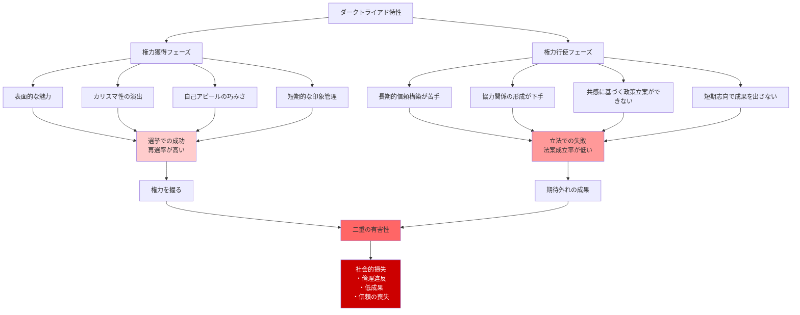

## 要約（Summary）

- サイコパスは表面的な魅力とカリスマ性で権力を獲得するのが得意だが、実際の成果（法案成立など）では劣る
- 選挙で選ばれた議員の調査では、ダークトライアド傾向が強い人ほど再選されやすいが、法案を成立させるのが下手
- ダークトライアドは社会にとって二重の意味で有害：不適切な人が権力を握り、さらに期待外れの成果しか出さない

## 本文（Body）

### 背景・問題意識

サイコパスが権力を握ることは問題だが、もっと深刻なのは、**権力を握った後に何をするか**である。

テン・ブリンクの研究は、ダークトライアド特性を持つ政治家を対象に、選挙での成功と立法での成果を比較した。結果は驚くべきものだった。

### アイデア・主張

#### パラドックスの本質

**権力獲得**：
- ダークトライアド特性を持つ人は、魅力的でカリスマ性があるように見える
- 選挙での成功率が高く、**再選されやすい**

**権力行使**：
- 精神病質的な特性をあまり持っていない人ほど有能ではない
- 法案を成立させるのが**下手**
- 実際の成果（立法、政策実現）では劣る

#### なぜこのパラドックスが発生するのか

**1. スキルセットの違い**：
- **権力獲得に必要なスキル**：表面的な魅力、自己アピール、短期的な印象管理、戦略的操作
- **権力行使に必要なスキル**：長期的な信頼構築、協力関係の形成、倫理的判断、共感に基づいた交渉

サイコパスは前者には長けているが、後者には劣る。

**2. 短期志向 vs 長期志向**：
- サイコパスは短期的な利益（選挙での勝利、目立つポジション）を優先
- 長期的な成果（法案成立、政策の実現）には関心が薄い

**3. 協力の欠如**：
- 法案を成立させるには、他の議員との協力や妥協が必要
- サイコパスは他者を操作しようとするため、信頼を築けず、協力を得られない

**4. 共感の欠如**：
- 有権者のニーズを真に理解し、それに応える政策を作るには共感が必要
- サイコパスは表面的には共感を示せるが、実際の政策立案では有権者の利益を無視しがち

#### 二重の有害性

ダークトライアドは社会にとって**二重の意味で有害**：

1. **選抜段階での問題**：不適切な人が権力を握る（権力を濫用する可能性が高い）
2. **成果段階での問題**：権力を効果的に使えず、期待外れの働きしかしない

結果として、社会は**最悪の両方**を得る：倫理的に問題がある人物が権力を握り、さらに無能である。

### 内容を視覚化するMermaid図

### 具体例・ケース

**選挙で選ばれた議員の研究（テン・ブリンク）**：
- ダークトライアド傾向が強い議員は**再選率が高い**
- しかし、**法案成立数は少ない**
- 有権者は、彼らの魅力的な演説に惹かれるが、実際の立法成果は伴わない

**企業のCEO**：
- サイコパス的特性を持つCEOは、カリスマ性で投資家を魅了し、高い報酬を得る
- しかし、長期的な企業成長や従業員の満足度では劣る
- 短期的な株価上昇を優先し、長期的な価値創造を犠牲にする

**独裁者**：
- クーデターや革命で権力を獲得する能力には長けている
- しかし、国家の統治（経済成長、国民の福祉向上）では失敗することが多い
- 権力の維持に執着し、実際の統治能力は低い

**プロジェクトリーダー**：
- 自己アピールが上手く、プロジェクトリーダーに選ばれる
- しかし、チームメンバーとの協力関係を築けず、プロジェクトが遅延・失敗する
- 成果よりも自分の評価を優先する

### 反論・限界・条件

**すべてのカリスマ的リーダーが無能ではない**：
- カリスマ性と有能さを両立するリーダーも存在する
- 表面的な魅力だけでサイコパスと判断するのは誤り

**短期的成果 vs 長期的成果**：
- サイコパスは短期的には成果を出すことがある（大胆な決断、リスクテイク）
- 長期的な評価が重要だが、短期的成果も無視できない

**測定の難しさ**：
- 「成果」の定義は主観的（法案成立数、株価、部下の満足度など）
- 成果が低い原因が、個人の能力なのか、外部環境なのかを区別するのは困難

**組織文化の影響**：
- サイコパス的リーダーが成果を出せない理由の一部は、組織文化（協力を重視する文化）にもある
- より競争的で短期志向の文化では、サイコパスが成果を出しやすい可能性もある

## 関連ノート（Links）

- [[20251227031852-dark-triad-three-personality-traits|ダークトライアド：権力を握る3つの暗黒特性]] - ダークトライアドの定義と特徴
- [[20251227031854-dark-triad-hiring-advantage|採用プロセスにおけるダークトライアドの優位性]] - 権力獲得で有利になる理由
- [[20251227031855-corporate-psychopath-prevalence|企業幹部層でのサイコパス高率現象]] - サイコパスが実際に上層部に到達している証拠
- [[20251223233911-power-corrupts-mechanism|権力による腐敗メカニズム：権力が人の共感と行動を変える理由]] - 権力獲得後の更なる劣化
- [[20251223234018-system-design-prevent-power-corruption|権力腐敗を防ぐシステム設計の3要素：選抜・責任・監視]] - このパラドックスへの対策

## To-Do / 次に考えること

- [ ] 自社のリーダー評価で、「選抜時の魅力」と「実際の成果」を分けて評価する仕組みを導入
- [ ] 幹部の成果を、短期的指標（株価、売上）だけでなく、長期的指標（従業員満足度、倫理的行動）でも測定
- [ ] 再選・昇進の基準に、「協力関係の構築」「チームの成果」を明示的に含める
- [ ] 「カリスマ的だが成果が伴わないリーダー」を早期に発見し、適切なフィードバックや配置転換を行う
