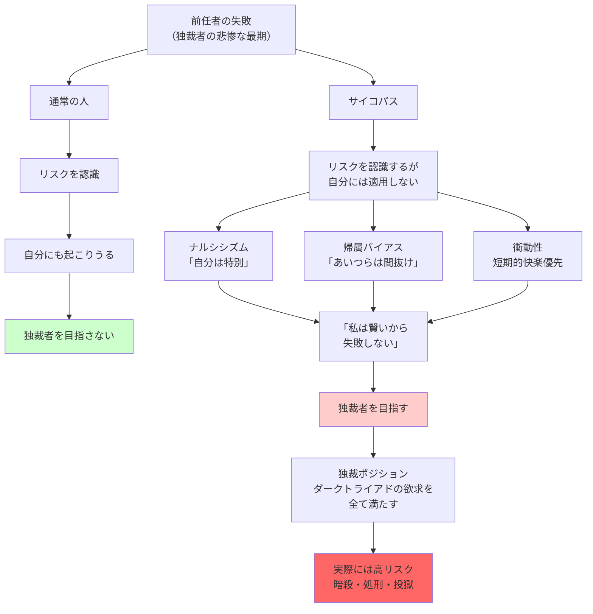

## 要約（Summary）

- サイコパスは一貫してリスクを無視し、前任者たちが失敗したリスクでも「自分には当てはまらない」と思い込む
- ナルシシズムにより、「あいつらは間抜けだったから失敗した。だが私は特別だから成功する」と考える
- この認知の歪みが、独裁者や高リスクポジションへの志向を説明する

## 本文（Body）

### 背景・問題意識

独裁者の多くは悲惨な最期を迎える：暗殺、クーデター、処刑、投獄。それにもかかわらず、なぜ次々と独裁者になろうとする人が現れるのか？

テン・ブリンクは、「サイコパスは一貫してリスクを無視する」と指摘する。彼らは、前任者の失敗を自分にも適用される教訓とは考えない。

### アイデア・主張

#### サイコパスのリスク認識の特徴

**1. リスクの一貫した無視**：
- サイコパスは、客観的に危険な状況でも、リスクを軽視する
- 独裁者の多くが悲惨な最期を迎えることを知っていても、「自分には起こらない」と考える

**2. ナルシシズムによる「特別視」**：
- 「自分は特別だから、前任者たちを見舞ったリスクは自分には当てはまらない」
- 前任者の失敗を、「あいつらは間抜けだったから」と他者の無能のせいにする
- 「私は賢いから、金輪際そんな目には遭わない」と確信する

**3. マキャヴェリズムによる戦略的楽観主義**：
- 「自分は策略と操作で、前任者よりうまくやれる」と考える
- リスクを認識していても、「自分なら回避できる」と過信する

#### 独裁者がサイコパスにとって「夢の仕事」である理由

独裁者というポジションは、ダークトライアドの頂点にいる人にとって理想的：

**マキャヴェリストの欲求を満たす**：
- 権謀術数の限りを尽くし、完全な支配権を獲得できる
- 「目的は手段を正当化する」という信念を最大限に発揮できる

**精神病質の欲求を満たす**：
- 誰でも好き勝手に選んで虐待、拷問できる
- 他者の苦痛を感じずに冷酷な決断を下せる

**ナルシシズムの欲求を満たす**：
- 冷酷な行動をしている間も、誰もが称賛してくれる
- 「ボス、今日は足の爪を引っぺがしたときが、とびきり見事でしたね」というおべっかを受けられる
- 自己の誇大性を最大限に満たせる

#### リスク無視の認知メカニズム

**選択的注意**：
- 前任者の失敗例（暗殺、処刑）は「彼らが無能だったから」と認識
- 一時的な成功例（独裁的権力の享受）には注目する

**帰属バイアス**：
- 他者の失敗を内的要因（無能、愚かさ）に帰属
- 自己の成功を内的要因（賢さ、特別性）に帰属
- 結果として、「自分は他者とは違う」という確信が強化される

**衝動性**：
- サイコパスは衝動的で、長期的な結果を考慮しない
- 独裁者になることの短期的な魅力（権力、快楽）が、長期的なリスク（暗殺）を圧倒する

### 内容を視覚化するMermaid図

### 具体例・ケース

**独裁者の末路**：
- スターリン（暗殺疑惑）、ヒトラー（自殺）、ムッソリーニ（処刑）、チャウシェスク（処刑）、カダフィ（リンチ殺害）
- これらの例を知っていても、新たな独裁者が次々と現れる
- 「自分は彼らより賢い」と考えるから

**企業のワンマン経営者**：
- 前任のワンマンCEOが解任されたり、企業を破綻させたりしても、次のワンマンCEOが現れる
- 「前任者は戦略を間違えた。私は正しい戦略を持っている」と確信している

**ハイリスク投資**：
- サイコパス的特性を持つトレーダーは、過去に多くの人が破産したハイリスク取引でも躊躇しない
- 「自分は他の人より優れている」という過信

**スタートアップCEO**：
- 多くのスタートアップが失敗する中、サイコパス的CEOは「自分は特別だから成功する」と確信
- リスクを無視した拡大戦略を取り、最終的に破綻することが多い

### 反論・限界・条件

**リスクテイクの適応的側面**：
- すべてのリスクテイクが悪いわけではない
- イノベーションや社会変革には、一定のリスクテイクが必要
- サイコパスのリスク無視が、時に画期的な成果をもたらすこともある

**ナルシシズムの程度**：
- 軽度のナルシシズムは、自信と野心の源泉として適応的
- 問題は、**過度な**ナルシシズムによるリスク無視

**状況的要因**：
- リスクが実際に顕在化しない場合、サイコパスの楽観主義が正しいこともある
- 独裁者の中には、長期間権力を保持し続ける者もいる（選択的サンプリングの問題）

**測定の難しさ**：
- リスク認識の欠如を直接測定するのは困難
- サイコパスが実際にリスクを認識していないのか、認識しているが無視しているのかを区別するのは難しい

## 関連ノート（Links）

- [[20251227031852-dark-triad-three-personality-traits|ダークトライアド：権力を握る3つの暗黒特性]] - ナルシシズムとマキャヴェリズムの定義
- [[20251227031857-psychopath-leadership-paradox|サイコパスのリーダーシップ・パラドックス]] - 権力獲得後の実際の成果（リスク無視の帰結）
- [[20251227031859-overconfidence-evolutionary-mismatch|自信過剰と権力獲得の進化的ミスマッチ]] - サイコパスに限らず、自信過剰が権力獲得を促進する
- [[20251223233911-power-corrupts-mechanism|権力による腐敗メカニズム：権力が人の共感と行動を変える理由]] - 権力獲得後のリスク認識の更なる低下
- [[20251226093115-evolutionary-mismatch-leadership|進化的ミスマッチとリーダーシップ選択]] - なぜリスク無視が選ばれてしまうのか

## To-Do / 次に考えること

- [ ] 自社のリーダー候補者に、過去の失敗事例から学ぶ能力があるか評価
- [ ] リスク評価プロセスで、「自分は特別」という過信を排除する仕組み（悪魔の代弁者、シナリオ分析）を導入
- [ ] ハイリスク決定において、複数の視点（慎重派と楽観派）を取り入れる意思決定プロセスを構築
- [ ] 過去の失敗を「他者の無能」として片付けず、構造的要因を分析する習慣を組織に根付かせる
