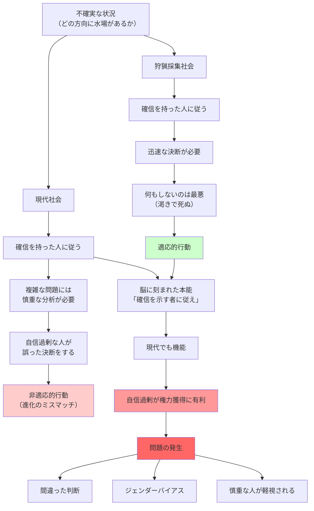

## 要約（Summary）

- 人間は階級制と自信の両方に従う傾向があり、不確実な状況では確信を示す者に心をつかまれる
- 自信過剰が権力獲得に有利なのは、過去の環境（狩猟採集社会）では適応的だったが、現代では非適応的な進化のミスマッチ
- ジェンダーバイアスも存在：男性は大言壮語しがちで、女性は慎重・正直な表現をするため、男性が不当に評価される

## 本文（Body）

### 背景・問題意識

なぜ「しばしば間違っているにもかかわらず、いつも自分は正しいという確信を抱いている人」が権力を握るのか？

人間には、**確信を持った人に従う**という強い傾向がある。これは狩猟採集社会では適応的だったが、現代社会では誤ったリーダーを選ぶ原因となっている。

### アイデア・主張

#### 人間の2つの従う傾向

**1. 階級制への服従**（ミーアキャット型）：
- 明確な上下関係がある場合、上位者に従う
- 組織の階級構造に基づいた服従

**2. 自信への追従**（野生の犬型）：
- 不確実な状況では、**確信を示す者**に従う
- 自信過剰な人でも、確信を持って語れば心をつかまれる

人間は、この両方を合わせた振る舞いを見せる。

#### 狩猟採集社会での適応性

**過去の環境**：
- 生死を分ける決断（どちらの方向に水場があるか、獲物を追うべきか）を迅速に下す必要
- 情報が限られた状況で、確信を持った人に従うことは合理的だった
- 何もしないでいるのは最悪（渇きで死ぬ）であり、確信を持った人に従う方がまだまし

**現代社会**：
- 複雑な問題（経済政策、気候変動対策など）には、慎重な分析と謙虚さが必要
- しかし、私たちは依然として「確信を持った人」に惹かれる
- これが**進化のミスマッチ**：過去には適応的だった行動が、現代では非適応的

#### 自信過剰が報われる構造

**研究助成金の例（ビル＆メリンダ・ゲイツ財団）**：
- 研究の潜在的影響について**幅広く大胆な言葉**を使った提案が、より多くの助成金を受けた
- **幅が狭く専門的な言葉**を使った提案は、助成金が少なかった
- ところが、実施後の研究の質は**同等**だった
- 大言壮語は助成金を得るのに有利だが、実際の成果とは無関係

**ジェンダーバイアス**：
- **男性**：大言壮語しがちで、裏づけのない大胆な主張をする
- **女性**：裏づけることができる正直で慎重な言葉を使う
- 結果として、**男性がより多くの助成金を得た**
- 自信過剰を受け容れやすい傾向が、性別による不公平を生んでいる

#### しばしば間違っているのに、いつも確信を持つ人

「しばしば間違っているにもかかわらず、いつも自分は正しいという確信を抱くことが、私たちの世界のあまりに多くの場面で依然として必勝法」

- 政治家、経営者、専門家の中には、実際の能力とは無関係に自信過剰な人が多い
- 彼らの予測や判断はしばしば外れるが、確信を持って語るため信頼される
- 一方、慎重で謙虚な専門家は、「自信がない」と見なされ軽視される

### 内容を視覚化するMermaid図

### 具体例・ケース

**政治家の演説**：
- **自信過剰な政治家**：「私には明確なビジョンがある。必ず実現する」と断言
- **慎重な政治家**：「複雑な問題なので、慎重に検討する必要がある」と留保
- 有権者は前者に惹かれ、後者を「優柔不断」と見なす

**経営者の戦略発表**：
- **自信過剰なCEO**：「この新戦略で業績を倍増させる」と断言
- **慎重なCEO**：「不確実性はあるが、この戦略が最善と考える」と留保
- 投資家は前者を「力強いリーダー」、後者を「自信がないリーダー」と評価

**研究助成金**：
- **男性研究者**：「この研究は医療を革命的に変える」と大胆に主張
- **女性研究者**：「この研究は特定の疾患の理解を深める可能性がある」と慎重に表現
- 前者がより多くの助成金を得るが、実際の成果は同等

**新型コロナウイルスのパンデミック**：
- 一部の専門家や政治家は、確信を持って「すぐに終息する」と断言
- 慎重な専門家は「不確実性が高く、長期化する可能性もある」と警告
- 初期段階では、前者が注目されたが、結果的には後者が正しかった

### 反論・限界・条件

**適応的な自信の存在**：
- すべての自信が過剰なわけではない
- 根拠のある自信は、リーダーシップに不可欠
- 問題は、**根拠のない**自信過剰

**状況依存性**：
- 緊急時（災害、戦争）には、確信を持ったリーダーが必要な場合もある
- 慎重すぎるリーダーは、迅速な決断ができず、被害が拡大する可能性

**教育と意識で緩和可能**：
- 進化的ミスマッチを意識することで、自信過剰への盲目的な追従を減らせる
- データに基づいた評価、複数の意見の聴取、慎重な分析を重視する文化を構築できる

**ジェンダーバイアスへの対処**：
- 匿名評価、構造化された評価基準、多様な評価者の採用で、ジェンダーバイアスを減らせる

## 関連ノート（Links）

- [[20251226093115-evolutionary-mismatch-leadership|進化的ミスマッチとリーダーシップ選択]] - 進化的ミスマッチの全体像
- [[20251227031858-psychopath-risk-blindness-exceptionalism|サイコパスのリスク認識欠如：「自分は特別」という思い込み]] - サイコパスの自信過剰
- [[20251227031852-dark-triad-three-personality-traits|ダークトライアド：権力を握る3つの暗黒特性]] - ナルシシズムと自信過剰
- [[20251226093545-gender-bias-leader-evaluation|ジェンダーバイアスとリーダー評価の歪み]] - 自信過剰がジェンダーバイアスを増幅
- [[20251223233758-power-seeking-self-selection-bias|権力への自己選択バイアス：不適切な人がリーダーになる構造]] - 自信過剰な人が権力を求める理由

## To-Do / 次に考えること

- [ ] リーダー候補者の評価で、「自信」と「根拠のある判断」を区別する基準を設ける
- [ ] 意思決定プロセスで、確信を持った意見だけでなく、慎重な意見も重視する文化を構築
- [ ] 大言壮語と慎重な表現のジェンダー差を認識し、評価基準を調整する
- [ ] 自分自身が「確信を持った人」に盲目的に従っていないか、定期的に自己点検
