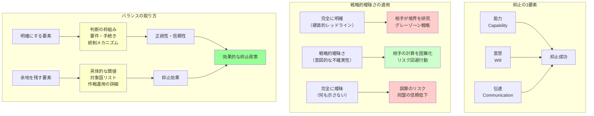

## 要約（Summary）

- 戦略的曖昧さ（Strategic Ambiguity）とは、安全保障政策において対応の不確実性を意図的に残すことで、相手の望ましくない行動を抑止する戦略
- 「どこから先で武力行使するか」を相手に完全に読ませないことで、相手に"やったら損だ"と思わせ、行動を思いとどまらせる抑止効果がある
- ただし、曖昧さを残しすぎると同盟の信頼性や民主的統制が損なわれるため、「原則と統制は明確、運用は一定の余地」というバランスが重要

## 本文（Body）

### 背景・問題意識

安全保障政策において、「どの条件で武力を行使するか」を事前に完全に明示すると、相手がその境界線を研究し、"ラインの手前で最大限やる（グレーゾーンで刻む）"戦略をとりやすくなる。

一方で、すべてを曖昧にすると、同盟国や国民からの信頼を失い、誤算のリスクも高まる。**どこまで明確にし、どこに余地を残すか**という設計が、抑止と統制の両立の鍵となる。

### アイデア・主張

**戦略的曖昧さは、相手の行動を不確実性によって抑止する政策ツールである。**

#### 戦略的曖昧さの定義

- **定義**：相手の望ましくない行動を抑止するために、こちらの対応を意図的に不確実にする政策
- **目的**：相手に「どこまでやれば反撃されるかわからない」と思わせ、リスク回避的な行動を誘導する
- **典型例**：NATOの集団防衛（Article 5）は「各国が必要と判断する行動をとる」という含みを残し、完全に自動的な軍事介入を約束していない

#### 抑止のメカニズム

抑止（Deterrence）は「相手に"やったら損だ"と思わせて、思いとどまらせる」こと。そのためには：

1. **能力（Capability）**：反撃できる力があること
2. **意思（Will）**：反撃する意思があること
3. **伝達（Communication）**：相手がそれを理解していること

戦略的曖昧さは、この3要素のうち**意思の伝達に"幅"を持たせる**ことで、相手の計算を難しくする。

#### 曖昧さの効果

**相手の行動を抑制**：
- 硬直的なレッドラインを公表すると、相手は「ライン手前なら安全」と計算できる
- 曖昧さを残すと、相手は「どこから反撃されるかわからない」ので、より慎重になる

**抜け道の研究を困難化**：
- 具体的な閾値（例：「領海侵入3回で武力行使」）を公表すると、相手は「2回までなら大丈夫」と学習
- 曖昧な要件（例：「総合的に判断」）は、相手の攻略を難しくする

### 内容を視覚化するMermaid図

### 具体例・ケース

**NATOの集団防衛（Article 5）**：
- 「加盟国への攻撃は全体への攻撃とみなす」と宣言
- ただし「各国が必要と判断する行動（including the use of armed force）をとる」と記述
- 自動的な軍事介入を約束せず、一定の"幅"を残している
- これにより、ロシアは「NATO加盟国への攻撃がどこまで反撃を招くか」を完全には読めない

**日本の存立危機事態**：
- 「明白な危険」「密接な関係にある他国」などの要件は抽象的
- 具体的な閾値や対象国リストを公表していない
- 相手に「どこまでやれば日本が武力行使するか」の予測を困難にする効果がある
- ただし、国内では「曖昧すぎて拡大解釈の余地がある」との批判も

**台湾をめぐる米国の政策**：
- 伝統的に「台湾への軍事支援を約束するか」を明言しない戦略的曖昧さを採用
- 中国には「台湾侵攻すれば米国が介入するかもしれない」、台湾には「独立宣言すれば米国が支援しないかもしれない」という不確実性を与え、双方の急進的行動を抑止
- 近年、一部の政治家が「明確化すべき」と主張する動きもあるが、曖昧さの維持が主流

### 反論・限界・条件

**曖昧さのデメリット**：
- **誤算のリスク**：相手が「本当に反撃するか」を読み違え、意図せず紛争に発展する可能性
- **同盟の信頼性**：同盟国が「本当に守ってくれるのか」と疑問を持ち、信頼が損なわれる
- **民主的統制**：国内で「政府の裁量で何でもできる」ように見えると、予測可能性と説明責任が低下

**曖昧さが有効な条件**：
- 相手がリスク回避的な性格を持つ（不確実性を嫌う）
- 同盟国との信頼関係が別の手段で維持されている
- 国内での手続きと統制メカニズムが明確

**実務的なバランス**：
- **明確にする**：判断の枠組み、要件、意思決定プロセス、国会関与、説明責任の型
- **余地を残す**：具体的な閾値、対象国リスト、作戦運用の詳細

## 関連ノート（Links）

- [[20251227035250-japan-survival-crisis-situation-limited-collective-self-defense|日本の存立危機事態と限定的集団的自衛権]] - 戦略的曖昧さの具体例
- [[20251227035500-legal-abstraction-vs-strategic-ambiguity|法文の抽象性と戦略的曖昧さの区別]] - 曖昧さの種類を区別する
- [[20251223234018-system-design-prevent-power-corruption|権力腐敗を防ぐシステム設計の3要素：選抜・責任・監視]] - 民主的統制と透明性
- [[20251226033400-decision-traces-vs-rules|Decision TracesとRulesの本質的違い]] - ルールの抽象性と運用の記録
- [[20251214235033-claude-md-strategic-design-principles|CLAUDE.mdファイルの戦略的設計原則]] - 指示の明確性と柔軟性のバランス

## To-Do / 次に考えること

- [ ] 台湾問題における米国の戦略的曖昧さの歴史的変遷を調査
- [ ] 抑止理論の古典文献（Thomas Schelling等）を読み、理論的基礎を確認
- [ ] グレーゾーン事態（ハイブリッド戦争）における戦略的曖昧さの有効性を検討
- [ ] 同盟国との信頼構築と戦略的曖昧さの両立事例を収集
