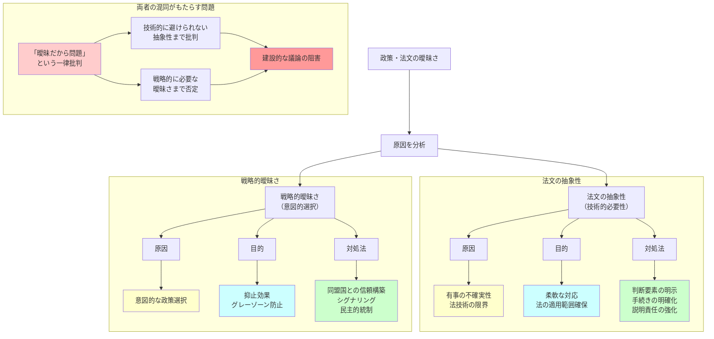

## 要約（Summary）

- 法文の抽象性（リーガルな抽象）と戦略的曖昧さは、どちらも「明確でない」ように見えるが、本質的に異なる現象
- 法文の抽象性は、技術的必要性（有事の不確実性への対応、法技術上の限界）から生じる
- 戦略的曖昧さは、意図的な政策選択（相手の行動を抑止するために、対応を不確実にする）
- 両者を混同すると、「曖昧だから問題」という批判が、技術的に避けられない抽象性にも向けられ、建設的な議論を妨げる

## 本文（Body）

### 背景・問題意識

安全保障法制（例：日本の存立危機事態）の要件が抽象的であることへの批判として、「曖昧すぎる」「拡大解釈の余地がある」という指摘がある。しかし、すべての曖昧さが同じ理由で生じているわけではない。

**「法文の抽象性」（技術的・やむを得ない）と「戦略的曖昧さ」（意図的・政策的選択）を区別しないと、改善可能な部分と改善すべきでない部分が見えなくなる。**

### アイデア・主張

**法文の抽象性と戦略的曖昧さは、原因・目的・対処法が異なる別物である。**

#### 1. 法文の抽象性（リーガルな抽象）

**原因**：
- **有事の不確実性**：現実の有事は目的・規模・場所・推移が千差万別で、事前に全ケースを網羅列挙できない
- **法技術上の限界**：具体的な条件を細かく書くと、想定外の事態に対応できず、逆に穴ができる

**特性**：
- 要件を抽象的に記述（例：「明白な危険」「総合的に判断」）
- ケースバイケースで客観的・合理的に判断すると説明
- 事前のチェックリストにはしない

**目的**：
- 柔軟な対応を可能にする
- 法の適用範囲を確保する

**対処法**：
- 判断要素を明示（何を考慮するか）
- 手続きと統制を明確化（誰がどう決めるか、国会承認など）
- 説明責任を強化（なぜその判断をしたかを事後的に説明）

#### 2. 戦略的曖昧さ（ストラテジック・アンビギュイティ）

**原因**：
- **意図的な政策選択**：相手に対応を完全に読ませないことで、抑止効果を高める

**特性**：
- 具体的な閾値や対象を公表しない（例：「どの国が攻撃されたら武力行使するか」を明言しない）
- 相手の計算を困難にする

**目的**：
- 相手の望ましくない行動を抑止する
- グレーゾーン戦略（境界線ギリギリを狙う）を防ぐ

**対処法**：
- 同盟国との信頼構築（非公開の事前調整）
- 能力と意思のシグナリング（演習、公式声明など）
- 民主的統制の確保（国会承認など、別のメカニズムで歯止め）

### 内容を視覚化するMermaid図

### 具体例・ケース

**日本の存立危機事態における2つの曖昧さ**：

**法文の抽象性の例**：
- 「我が国の存立を脅かし、国民の権利が根底から覆される明白な危険」という要件
- これは、有事の多様性（攻撃の規模、場所、推移など）に対応するため、ケースバイケースで判断せざるを得ない
- 政府答弁でも「攻撃国の意思・能力、発生場所、規模、態様、推移などを総合考慮」と説明
- **対処**：判断要素を列挙、対処基本方針の閣議決定、国会承認で民主的統制を確保

**戦略的曖昧さの例**：
- 「密接な関係にある他国」が具体的にどの国かを公表しない
- どの程度の攻撃で「存立危機」と認定するかの具体的閾値を示さない
- これにより、相手は「どこまでやったら日本が武力行使するか」を完全には読めない
- **対処**：同盟国（米国）との非公開調整、共同演習でシグナリング

**NATOの集団防衛（Article 5）**：
- 「各国が必要と判断する行動をとる」という記述は、法的抽象性と戦略的曖昧さの両方を含む
- **法的抽象性**：有事の多様性に対応するため、自動的な軍事介入を約束しない
- **戦略的曖昧さ**：ロシアに「NATO加盟国への攻撃がどこまで反撃を招くか」を読ませない

### 反論・限界・条件

**「法文の抽象性を減らせば戦略的曖昧さは不要では？」**

理論的には可能だが、実践的には：
- **ルールの爆発**：すべてのケースを事前に詳細化すると、法文が膨大になり管理不能
- **未知の未知**：将来どんな有事が起きるかは予測不可能
- **硬直性**：詳細すぎるルールは、想定外の事態で機能しない

**「両者を区別しても、結局は拡大解釈されるのでは？」**

- 区別することで、**どこに歯止めをかけるべきか**が明確になる
- 法文の抽象性には「判断要素の明示」「手続きの透明化」で対処
- 戦略的曖昧さには「同盟調整」「シグナリング」で対処
- 一律に「曖昧だからダメ」と言うより、建設的な改善策を議論できる

**成立条件**：
- 政策立案者が両者を意識的に区別している
- 判断要素と手続きが明文化されている
- 事後的な説明責任の仕組みがある

## 関連ノート（Links）

- [[20251227035250-japan-survival-crisis-situation-limited-collective-self-defense|日本の存立危機事態と限定的集団的自衛権]] - 法文の抽象性と戦略的曖昧さの両方を含む事例
- [[20251227035410-strategic-ambiguity-deterrence|戦略的曖昧さと抑止の関係]] - 戦略的曖昧さの詳細
- [[20251226033400-decision-traces-vs-rules|Decision TracesとRulesの本質的違い]] - ルールの抽象性と具体的な判断記録の関係
- [[20251223234018-system-design-prevent-power-corruption|権力腐敗を防ぐシステム設計の3要素：選抜・責任・監視]] - 透明性と説明責任の設計
- [[20251215095358-tag-enforcement-governance|作成時タグ強制によるガバナンス戦略]] - ルールと統制の設計

## To-Do / 次に考えること

- [ ] 他国の安全保障法制で、法文の抽象性と戦略的曖昧さがどう使い分けられているか調査
- [ ] 日本の行政法における「総合考慮」「裁量」の判例を読み、法的抽象性の統制方法を学ぶ
- [ ] 国際法（国連憲章51条など）における自衛権の要件の抽象性を分析
- [ ] 透明性と曖昧さのトレードオフを定量的に評価する方法を検討
