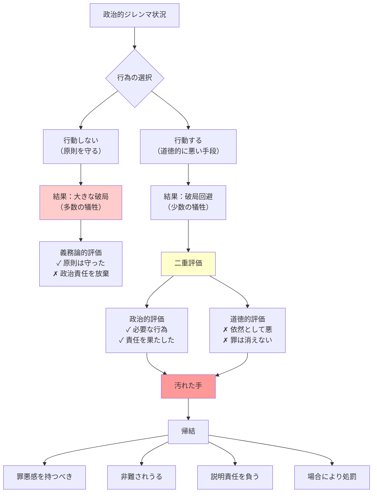

## 要約（Summary）

- 政治家が公共の善を守るために道徳的に悪い行為をせざるを得ない状況で、その行為が正当化されるのかというジレンマ
- 功利主義（結果主義）と義務論（原則主義）の両極端を批判し、「政治的には必要」だが「道徳的には悪い」という二重評価が同時に成立することを主張
- 「必要悪だから正当化される」でも「悪だから絶対禁止」でもなく、汚れを引き受けつつ説明責任を負うという不快で重い結論

## 本文（Body）

### 背景・問題意識

政治の世界では、しばしば道徳的に問題のある手段を取らなければ、より大きな破局を防げない状況が生じる。拷問によってテロ情報を得る、暴動鎮圧のための過剰な暴力、戦争での民間人犠牲、独裁者との取引など、現実の政治責任を担う者は「善き結果のために悪しき手段」を選ばざるを得ない場面に直面する。

このとき、「結果が良ければ手段は正当化される」と言い切ってよいのか？ それとも「悪は絶対に許されない」として政治責任を放棄すべきなのか？ マイケル・ウォルツァーは、この単純な二択を拒否する。

### アイデア・主張

#### 功利主義と義務論への批判

**功利主義（結果が良ければOK）の問題**：
- 「救えた人数が多いなら手段は正当化される」
- 政治の残酷さが"正しい"として洗い流されがち
- 権力者が「公共の利益のため」と称して道徳的コストを無視する免罪符になる

**義務論（悪は絶対ダメ）の問題**：
- 「拷問・嘘・裏取引などは絶対に禁止」
- 現実の政治責任（人命や社会秩序の維持）を担いきれない
- 原則を守って破局を招く無責任につながる

#### 二重評価の構造

ウォルツァーの「汚れた手」問題の核心は、**一つの行為に対して政治的評価と道徳的評価が同時に成立する**という点：

1. **政治的評価**：その行為は状況的に「やらないともっと大きな破局になる」ので必要
2. **道徳的評価**：それは依然として道徳的には悪い（罪が消えない）

この二重評価により：
- やるしかなかった（政治責任）
- しかし悪は悪だ（道徳責任）
- だから当人は汚れを引き受け、場合によっては非難や処罰も受けうる

#### 統治と倫理の接点

この議論の本質は、「政治に道徳の例外があるか」ではなく：
- 例外があるとしても、それを「正しかった」と言って道徳的コストをゼロにしてよいのか？
- コストを認めるなら、どうやって政治権力を統制し、責任を取らせるのか？

という**統治の設計と倫理の接点**に関する問いである。

### 内容を視覚化するMermaid図

### 具体例・ケース

**典型的な汚れた手の例**：
1. **テロ対策の拷問**：時限爆弾の場所を吐かせるための尋問で、拷問を使用するか
2. **暴動鎮圧**：多数の市民の安全のため、違法すれすれの暴力で鎮圧するか
3. **戦争の作戦**：軍事目標の破壊で非戦闘員の犠牲が予見されるが実行するか
4. **独裁者との取引**：和平のために人権侵害を行う独裁者と交渉・妥協するか

**よくある誤解**：
- 「政治家は汚いことをして当然」→ ウォルツァーは逆に、汚れをちゃんと汚れとして数えろという主張
- 「やむを得ないなら無罪」→ やむを得なくても悪は悪。曖昧にすると権力は腐敗する

### 反論・限界・条件

**「どこまでが許容される汚れで、どこからが腐敗か」の境界が不明確**：
- 必要性の条件（他に手段がないか、比例性、透明性、事後の説明責任、監査可能性）が必要
- これらの条件がなければ、単なる権力の濫用になる

**すべての政治的悪が「汚れた手」ではない**：
- 私的利益のための腐敗は汚れた手ではなく、単なる犯罪
- 公共の善のための真の必要性があるときだけ、汚れた手問題が成立する

**道徳的残余をどう扱うか**：
- 罪悪感を持つだけで十分なのか
- 実際の処罰や賠償が必要なのか
- この点はウォルツァーも明確な答えを出していない

## 関連ノート（Links）

- [[20251227052053-dual-evaluation-political-moral|汚れた手における二重評価：政治的必要性と道徳的悪性の並存]] - 二重評価のメカニズムを詳述
- [[20251227052054-moral-remainder-concept|道徳的残余：正当化後も消えない道徳的コスト]] - 汚れた手問題の重要な帰結
- [[20251226083130-reverse-dominance-hierarchy|逆順位制：支配されたくない欲望が生む平等社会]] - 権力の濫用を防ぐ社会構造
- [[20251227031855-corporate-psychopath-prevalence|企業幹部層でのサイコパス高率現象]] - 道徳的コストを無視する権力者の問題
- [[20251220050704-code-delivery-with-proof-of-work|エンジニアの責任は動作証明されたコードを届けることである]] - 責任の概念の別領域での適用

## To-Do / 次に考えること

- [ ] 必要性の条件（他に手段がないか、比例性、透明性、説明責任、監査可能性）を具体化するノートを作成
- [ ] 歴史的な「汚れた手」の事例（ヒロシマ・ナガサキ、特殊作戦など）を分析
- [ ] 企業経営や組織運営における「汚れた手」問題（リストラ、不採算事業撤退など）を考察
- [ ] 日常的な小規模な意思決定にも汚れた手問題が現れるか検討
