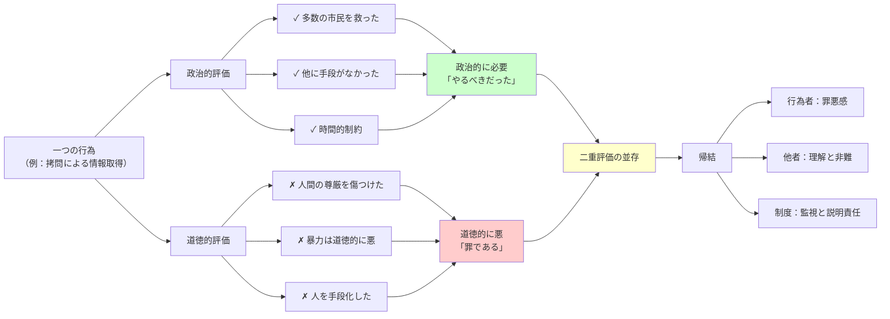

## 要約（Summary）

- 一つの行為が「政治的には必要」でありながら「道徳的には悪い」という二つの評価を同時に持つ構造
- 功利主義のように道徳的悪を結果で洗い流すのでもなく、義務論のように行為を全面的に禁止するのでもない第三の立場
- この二重性を認めることで、政治的責任を果たしつつ道徳的コストも引き受けるという緊張関係が生まれる

## 本文（Body）

### 背景・問題意識

従来の倫理学では、ある行為は「善い」か「悪い」かのどちらかである。功利主義者なら「結果が良ければ善い」、義務論者なら「原則に反すれば悪い」と判定する。

しかし、政治の領域では、この単純な二分法が機能しない場面がある。テロリストを拷問して多数の市民を救った場合、その行為は「善い」のか「悪い」のか？ ウォルツァーは、**両方である**と主張する。

### アイデア・主張

#### 二重評価の構造

**政治的評価の軸**：
- 状況的必要性：他に有効な手段がない
- 比例性：得られる利益が犠牲に見合う
- 結果：実際に破局を回避できた
- **結論**：政治的には「必要な行為」「やるべきだった」

**道徳的評価の軸**：
- 行為の本質：拷問、嘘、暴力などは道徳的に悪い
- 尊厳の侵害：人間の尊厳を傷つける
- 原則違反：「人を手段としてのみ扱わない」などの原則に反する
- **結論**：道徳的には「悪い行為」「罪である」

**重要な点**：
これら二つの評価は**同時に成立し、互いに打ち消し合わない**。政治的必要性が道徳的悪を正当化して消し去るわけでもなく、道徳的悪が政治的必要性を無効にするわけでもない。

#### 従来の倫理学との違い

| 立場 | 評価方法 | 問題点 |
|------|---------|--------|
| **功利主義** | 結果のみで評価 結果が良ければ行為は正当化される | 道徳的コストを無視 「目的が手段を正当化する」の濫用 |
| **義務論** | 原則のみで評価 原則に反すれば絶対禁止 | 政治的現実を無視 結果責任を放棄 |
| **二重評価** | 政治的評価と道徳的評価を並存 どちらも真である | 不快で重い結論 明確な答えが出ない |

#### 二重評価がもたらす緊張

この二重評価を認めることで：

1. **行為者の苦悩**：
   - 「正しいことをした」と開き直れない
   - 「間違ったことをした」と全否定もできない
   - 罪悪感と責任感の両方を抱える

2. **他者からの評価の複雑さ**：
   - 「やむを得なかった」と理解しつつ
   - 「それでも悪だった」と非難する
   - 賞賛と非難が同時に存在する

3. **制度設計への示唆**：
   - 必要悪を認めつつ濫用を防ぐ仕組みが必要
   - 透明性、説明責任、事後検証の制度化
   - 「例外」を明文化しすぎると悪用される

### 内容を視覚化するMermaid図

### 具体例・ケース

**ケース1：時限爆弾シナリオ**

状況：
- テロリストが都市のどこかに爆弾を仕掛けた
- 数時間後に爆発し、数千人が死ぬ
- 容疑者を捕らえたが、場所を話さない
- 拷問すれば話すかもしれない

二重評価：
- **政治的**：数千人の命 vs 一人への暴力 → 拷問は必要
- **道徳的**：拷問は人間の尊厳を踏みにじる → 拷問は悪

**ケース2：企業のリストラ**

状況：
- 企業の経営が悪化、このままでは全社員が失業
- 30%の人員削減で残り70%を救える
- 解雇される人々には家族がいる

二重評価：
- **政治的（経営的）**：多数を救うためのやむを得ない判断
- **道徳的**：個々人の生活を破壊する暴力

**ケース3：戦時の民間人犠牲**

状況：
- 敵の軍事施設を破壊すれば戦争を早期終結できる
- しかし周辺に民間人が住んでおり、巻き添えは避けられない

二重評価：
- **政治的（軍事的）**：長期戦を避け、総犠牲者を減らす
- **道徳的**：無辜の民間人を殺すことは殺人

### 反論・限界・条件

**「二つの評価が両立するのは論理矛盾では？」**

いいえ、評価の**次元が異なる**：
- 政治的評価：状況的・結果的な必要性の次元
- 道徳的評価：行為の本質・原則の次元
- 同じ次元で「善かつ悪」なら矛盾だが、異なる次元なら並存可能

**「実務ではどちらを優先すべきか？」**

この問いへの単純な答えはない。状況依存であり：
- 破局の規模が大きいほど、政治的必要性が重くなる
- しかし道徳的悪が消えるわけではない
- 事後の説明責任と反省が必須

**「すべての政治的決定に適用できるか？」**

いいえ、汚れた手問題が成立するのは：
- 真に公共の善のためである（私的利益は除外）
- 他に有効な手段がない（安易な選択は除外）
- 道徳的に重大な悪を含む（軽微な違反は除外）

## 関連ノート（Links）

- [[20251227052052-walzer-dirty-hands-problem|ウォルツァーの汚れた手問題]] - 二重評価が中心的な役割を果たす汚れた手問題の全体像
- [[20251227052054-moral-remainder-concept|道徳的残余：正当化後も消えない道徳的コスト]] - 二重評価から生まれる道徳的残余
- [[20251226083130-reverse-dominance-hierarchy|逆順位制：支配されたくない欲望が生む平等社会]] - 権力の二面性を抑制する社会メカニズム
- [[20251220050704-code-delivery-with-proof-of-work|エンジニアの責任は動作証明されたコードを届けることである]] - 責任の二重性（結果責任とプロセス責任）
- [[20251227031855-corporate-psychopath-prevalence|企業幹部層でのサイコパス高率現象]] - 道徳的評価を無視する権力者の危険性

## To-Do / 次に考えること

- [ ] 二重評価を組み込んだ意思決定フレームワークを設計
- [ ] 企業経営での二重評価の適用事例を収集（M&A、リストラ、不正対応など）
- [ ] 個人の日常的な意思決定にも二重評価が現れるか検討（家族、友人関係など）
- [ ] 二重評価を制度化する方法（事後検証委員会、倫理審査など）を考察
