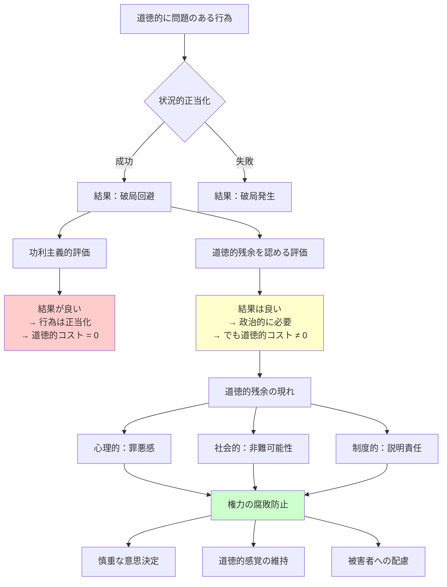

## 要約（Summary）

- 道徳的残余（moral remainder）とは、行為が状況的に必要だったとしても消えない道徳的な汚れや責任
- 功利主義的に「結果が良かったから問題ない」と洗い流すのではなく、罪悪感・非難可能性・説明責任が残る
- この概念は、政治権力が「必要悪」を免罪符にして腐敗するのを防ぐ重要な歯止めとなる

## 本文（Body）

### 背景・問題意識

政治や組織の意思決定では、「やむを得なかった」「他に選択肢がなかった」という言葉で道徳的に問題のある行為が正当化されることがある。しかし、本当に「やむを得なかった」なら、その行為は完全に無罪なのか？

マイケル・ウォルツァーは、たとえ行為が必要だったとしても、**道徳的な汚れは消えない**と主張する。この「消えない汚れ」が道徳的残余（moral remainder）である。

### アイデア・主張

#### 道徳的残余とは

**定義**：
- 行為が状況的に正当化されても、完全には消えない道徳的なコストや負債
- 行為者に残る罪悪感、他者からの非難可能性、説明責任の継続

**重要な特徴**：
1. **消去不可能性**：結果の良さによって洗い流されない
2. **行為者への重み**：当人は罪悪感を持つべき
3. **他者からの評価**：行為を理解しつつも非難しうる
4. **制度的帰結**：場合によっては処罰や賠償が必要

#### なぜ道徳的残余が重要か

**1. 権力の腐敗を防ぐ**：
- 「公共の利益のため」が免罪符になるのを防ぐ
- 権力者が道徳的コストをゼロと見なすことを許さない
- 安易に「必要悪」を選ぶことへの歯止め

**2. 行為者の慎重さを促す**：
- 道徳的残余があると知れば、本当に他に手段がないか真剣に探す
- 比例性（犠牲に見合う利益か）を厳しく吟味する
- 事後の説明責任を意識した決定になる

**3. 社会の道徳的感覚を維持**：
- 「結果オーライ」の風潮に流されない
- 原則の重要性を忘れない
- 被害者への共感と記憶を保つ

#### 道徳的残余の現れ方

**心理的次元**：
- 罪悪感、後悔、自責の念
- 「正しいことをした」と開き直れない苦悩
- トラウマやPTSD（特に暴力を行使した場合）

**社会的次元**：
- 他者からの批判や非難（理解しつつも）
- 歴史的評価の分かれ
- 被害者やその家族の恨み

**制度的次元**：
- 事後調査や検証委員会
- 賠償や謝罪の必要性
- 場合によっては法的責任や処罰

### 内容を視覚化するMermaid図

### 具体例・ケース

**ケース1：原爆投下の道徳的残余**

- **状況的正当化**：本土決戦を避け、数十万〜数百万の米兵と日本人の命を救った（とされる）
- **道徳的残余**：
  - 非戦闘員の大量殺戮という事実は消えない
  - 被爆者と遺族の苦しみは続く
  - 歴史的評価は今も分かれる
  - 「やむを得なかった」と言い切れない重み

**ケース2：企業のリストラ**

- **状況的正当化**：会社を存続させ、残りの従業員の雇用を守った
- **道徳的残余**：
  - 解雇された人々の生活破壊
  - 経営者の罪悪感（良心があれば）
  - 残った社員の士気低下と不信感
  - 「本当に他に方法はなかったのか」という問い

**ケース3：内部告発者の保護vs組織防衛**

- **状況的正当化**：組織の存続のため、内部告発者を黙らせた
- **道徳的残余**：
  - 告発者の人生を破壊した罪
  - 不正が続く社会的コスト
  - 後の発覚時の信用失墜
  - 「正義を裏切った」という汚れ

**ケース4：テロリストとの交渉**

- **状況的正当化**：人質の命を救うため、テロリストの要求を一部受け入れた
- **道徳的残余**：
  - テロを助長した責任
  - 次の犠牲者への間接的責任
  - 「テロに屈した」という評価
  - 原則を曲げた後ろめたさ

### 反論・限界・条件

**「道徳的残余を認めると、行為者が萎縮しないか？」**

確かにリスクはある。しかし：
- 萎縮して必要な決断ができないのも問題
- 道徳的残余を認識しつつ、それでもやるべき時はやる覚悟が必要
- 道徳的残余の重さが、「本当に必要か」の真剣な吟味を促す

**「罪悪感を持つだけで十分か？ 実際の処罰は必要か？」**

ウォルツァーも明確な答えを出していない。おそらく：
- ケースバイケースで判断
- 重大な違反なら処罰もありうる
- 軽微なら罪悪感と事後検証で十分
- 重要なのは「完全に無罪」とは見なさないこと

**「すべての行為に道徳的残余があるのか？」**

いいえ、道徳的残余が生じるのは：
- 行為が道徳的に問題を含む場合のみ
- 完全に正しい行為には道徳的残余はない
- しかし現実の政治では、完全に正しい選択肢は稀

## 関連ノート（Links）

- [[20251227052052-walzer-dirty-hands-problem|ウォルツァーの汚れた手問題]] - 道徳的残余が中心的な役割を果たす問題の全体像
- [[20251227052053-dual-evaluation-political-moral|汚れた手における二重評価]] - 道徳的残余を生み出す二重評価のメカニズム
- [[20251220050704-code-delivery-with-proof-of-work|エンジニアの責任は動作証明されたコードを届けることである]] - 技術的負債も一種の「残余」
- [[20251226083130-reverse-dominance-hierarchy|逆順位制：支配されたくない欲望が生む平等社会]] - 権力の濫用を社会が監視する仕組み
- [[20251227031855-corporate-psychopath-prevalence|企業幹部層でのサイコパス高率現象]] - 道徳的残余を感じない権力者の危険性

## To-Do / 次に考えること

- [ ] 道徳的残余を制度的に扱う方法を考察（真実和解委員会、事後検証委員会など）
- [ ] 企業経営での道徳的残余の事例を収集（M&A、リストラ、不正対応、内部告発など）
- [ ] 道徳的残余を無視する権力者（サイコパス的特性）をどう検出・排除するか
- [ ] 日常生活での小さな道徳的残余（友人との約束破り、小さな嘘など）も同じ構造か検討
