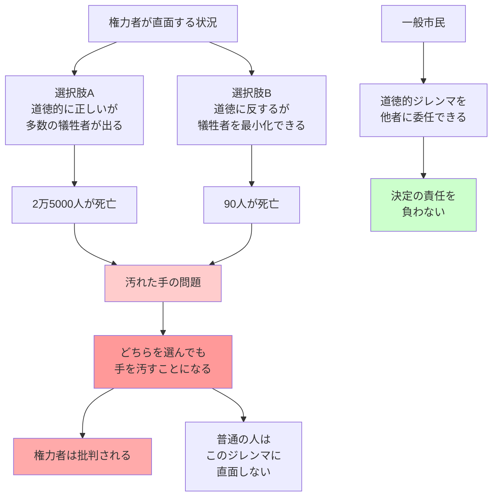

## 要約（Summary）

- 権力者は、すべての選択肢が道徳に反するような状況に追いやられることがあり、どの選択肢を選んでも悲惨な結果につながりうる
- これは「汚れた手の問題（Dirty Hands Problem)」と呼ばれ、権力者が悪質に見える理由の一つである
- 権力者が悪事を働くのは、必ずしも腐敗したからではなく、2つの恐ろしい選択肢を天秤にかけ、害の少ないほうを選ばざるをえない構造的な問題

## 本文（Body）

### 背景・問題意識

「権力は腐敗する」という格言は、権力を握った人が腐敗すると考えがちだ。しかし、権力者が道徳に反する決定を下すのは、必ずしも個人の腐敗が原因ではない。むしろ、権力を持つことで、普通の人なら直面しないような**解決不能な道徳的ジレンマ**に追い込まれることがある。

哲学者マイケル・ウォルツァーはこれを「汚れた手の問題」と名付けた。権限のある地位に就く人は、あらゆる選択肢が道徳に反するような状況で決断を迫られ、結果として「手を汚す」ことになる。

### アイデア・主張

**汚れた手の問題の本質**：

1. **道徳的ジレンマの構造**：権力者は、すべての選択肢が道徳的に問題を抱える状況に置かれる
   - 選択肢A：多くの人を危険にさらすが、道徳的には正しい
   - 選択肢B：少数の人を犠牲にするが、多くの人を救う

2. **普通の人との違い**：普通の人は深刻な道徳的罪を避けることができるが、権力者は別の道がない場合がある
   - 一般市民：道徳に反する決定を避け、他者に委ねることができる
   - 権力者：どの選択肢も誰かを傷つける状況で、決定を下さなければならない

3. **責任の所在**：権力者は「手を汚した」責任を負うべきだが、その決定が腐敗の証拠とは限らない
   - 道徳的に完璧な選択肢が存在しない状況での「次善の選択」である可能性がある

### 内容を視覚化するMermaid図

### 具体例・ケース

**チャーチルとシドニー号事件**：
- 第二次世界大戦中、チャーチルはエニグマ暗号を解読し、オーストラリア艦船シドニーが攻撃されることを知った
- もしシドニーに警告すれば、ドイツ側が暗号解読に気づき、戦争全体で多くの命が失われる可能性があった
- チャーチルは警告しないことを選び、シドニーの乗員645人全員が死亡した
- これは腐敗ではなく、より大きな善（ナチスの打倒）のために手を汚した例

**リンカーンと奴隷制度廃止**：
- 憲法修正第13条を可決させるため、リンカーンは下院の反対者たちを事実上買収した
- 無関係の法案で譲歩し、票を買うという「腐敗」を行った
- しかし、それははるかに大きな善（奴隷制度の廃止）のためだった
- タデウス・スティーヴンズは「19世紀随一の法案は、アメリカで最も清廉な人物に後押しされ、扇動され、腐敗によって可決された」と書いた

**タイ首相アピシットと抗議鎮圧**：
- 2010年、バンコクで大規模な抗議活動が発生
- アピシット首相は、抗議者の増加を許せば内戦で2万5000人が死ぬと判断
- 抗議を鎮圧し、結果として90人以上が死亡
- 彼は批判されたが、より多くの死者を防ぐために手を汚したと主張

### 反論・限界・条件

**「汚れた手」の濫用リスク**：
- すべての権力者の悪行が「汚れた手の問題」で正当化されるわけではない
- 権力者は「仕方なかった」という言い訳を濫用する可能性がある
- 実際には他の選択肢があったにもかかわらず、ジレンマを装うケースもある

**判断基準の曖昧さ**：
- 「害の少ないほう」をどう判断するかは極めて困難
- 反事実（もし別の選択をしていたら）は検証不可能
- 権力者の判断が本当に正しかったかは、事後的にも評価が難しい

**責任の所在**：
- 「汚れた手の問題」は権力者を免罪するものではない
- たとえジレンマであっても、権力者は人権侵害の責任を負わなければならない
- 道徳的に完璧な選択肢がないことと、責任を負わないことは別問題

**すべての権力者に当てはまるわけではない**：
- 破綻した国家や戦時など、極限状況でのみ発生する
- 平時の民主国家では、道徳的ジレンマは少ない
- 権力者が自らジレンマを作り出すケース（政策の失敗など）もある

## 関連ノート（Links）

- [[20251223233911-power-corrupts-mechanism|権力による腐敗メカニズム：権力が人の共感と行動を変える理由]] - 権力が人を実際に腐敗させるメカニズム（汚れた手とは異なる現象）
- [[20251223233758-power-seeking-self-selection-bias|権力への自己選択バイアス：不適切な人がリーダーになる構造]] - 権力を求める段階での問題
- [[20251223234018-system-design-prevent-power-corruption|権力腐敗を防ぐシステム設計の3要素：選抜・責任・監視]] - 汚れた手の問題への制度的対策
- [[20251227035410-strategic-ambiguity-deterrence|戦略的曖昧さと抑止の関係]] - 国際関係における道徳的ジレンマの例
- [[20251226082726-institutional-quality-attracts-matching-people|制度の質が引き寄せる人材の質：腐敗の自己強化メカニズム]] - 制度設計の重要性

## To-Do / 次に考えること

- [ ] 自社の経営判断で「汚れた手の問題」に該当するケースがあったか振り返る
- [ ] リーダーが道徳的ジレンマに直面したときの意思決定プロセスを設計する（透明性、説明責任の確保）
- [ ] 「仕方なかった」という言い訳の濫用を防ぐチェック機構を検討する
