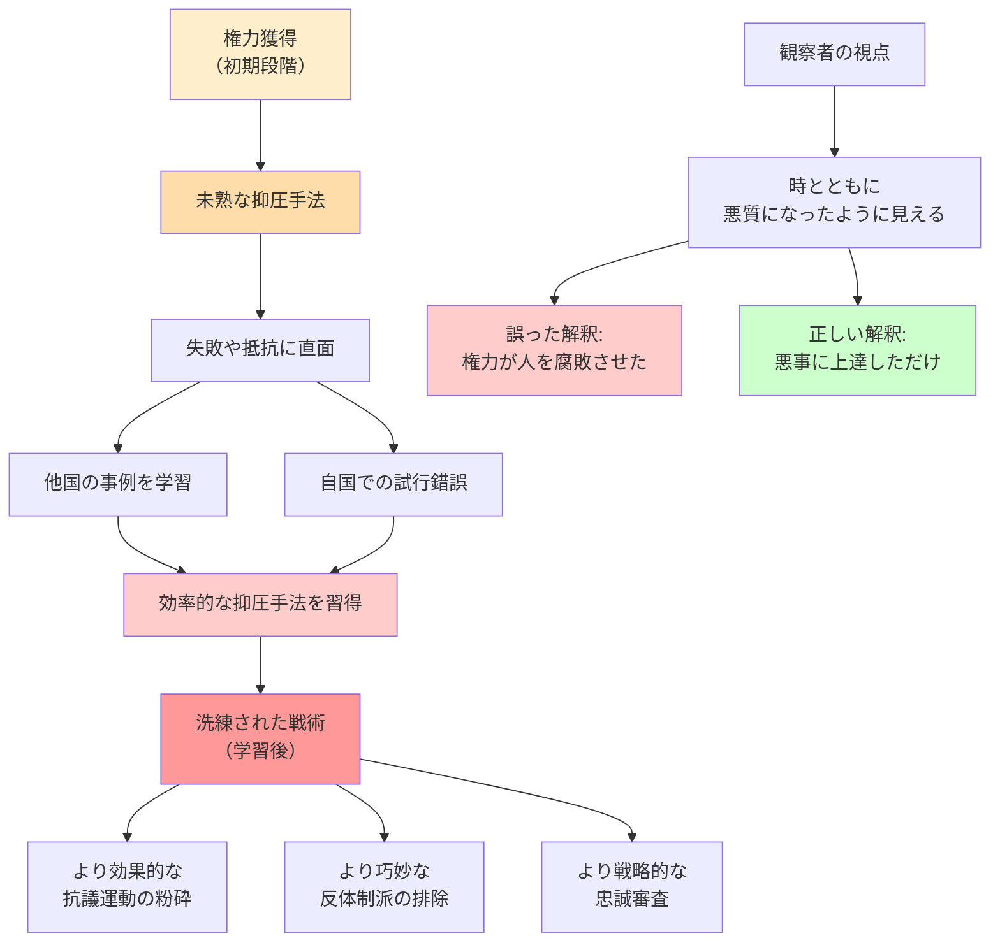

## 要約（Summary）

- 権力者が時とともにしだいに悪質になるように見えるのは、必ずしも腐敗したからではなく、**悪事の戦術が上達した**からである
- これは「独裁支配学習（Authoritarian Learning）」と呼ばれ、独裁者が抗議運動の粉砕方法や反体制派の消し去り方を学習していく現象
- 権力者の悪意は変わっておらず、ただ悪行が上達しただけであり、「権力が人を腐敗させる」とは異なるメカニズム

## 本文（Body）

### 背景・問題意識

権力者が長期間権力を握ると、しだいに悪質になっていくように見える。これは「権力が人を腐敗させる」証拠と解釈されがちだ。しかし、もう一つの可能性がある。**権力者はもともと腐敗していたが、時間とともに悪事の手法が洗練されただけ**かもしれない。

データを分析すると、誰かが時とともにしだいに悪質になっているように見えるだろう。だがじつは、その人の悪意は変わっておらず、腕が上がっただけかもしれない。その人は常に腐敗していた。ただ、悪行が上達しただけなのだ。

### アイデア・主張

**独裁支配学習の本質**：

1. **学習は権力維持の必須要因**：
   - 権力を獲得し、手放さずにいるためには、抑圧の手法を学習する必要がある
   - 初期段階では未熟な抑圧で失敗することもあるが、時間とともに効率的な手法を身につける

2. **戦術の進歩≠性格の変化**：
   - 権力者の本質的な悪意や腐敗は変わっていない
   - 変わったのは、その悪意を実行する**能力と効率性**
   - 「前より悪質になった」のではなく、「前より巧妙になった」

3. **知識共有のネットワーク**：
   - 独裁者たちはサミットを開き、考え方を共有することがある
   - 「抗議運動の粉砕──事例研究」「反体制派をどのように消し去るか」といった知識が伝播する
   - 他国の成功事例を模倣し、失敗事例から学ぶ

4. **奇妙な戦術の合理性**：
   - 独裁者の行動は奇妙に見えるが、じつは戦略的で合理的
   - 例：荒唐無稽な神話の作成は、**忠誠審査**の役割を果たす
   - 不条理な噓を繰り返す者は信頼できる（政権への忠誠の証）

### 内容を視覚化するMermaid図

### 具体例・ケース

**北朝鮮の個人崇拝と忠誠審査**：
- 金王朝は「チュチェ思想」という神学体系をまるごと作り上げた
- 一見、荒唐無稽な神話に見えるが、実際には**忠誠審査**の役割を果たす
- 不条理な噓をまくしたてる者は、政権の信頼に値する
- 神話がしだいに極端になるのは、ラチェット効果（常に新しい忠誠テストが必要）

**中国の抗議活動監視の進化**：
- 初期段階では、抗議活動への対処が未熟で、過剰な暴力や不十分な監視が問題だった
- 時間とともに、AIによる顔認識、ソーシャルメディア監視、予防的拘束などの手法を洗練
- 「独裁支配学習」によって、より効率的で目立たない抑圧が可能になった

**ロシアの反体制派弾圧の洗練**：
- 初期には粗雑な暗殺や逮捕が目立ち、国際的な批判を招いた
- 学習を経て、法的手続きを装った弾圧、間接的な圧力、情報操作などの手法を習得
- 「腐敗した」のではなく、「巧妙になった」

### 反論・限界・条件

**学習と腐敗の区別の困難さ**：
- 実際には「学習」と「腐敗」の両方が同時に起こっている可能性がある
- 権力者が時とともに共感を失い（腐敗）、同時に戦術も洗練される（学習）
- 2つのメカニズムを完全に分離することは難しい

**すべての権力者に当てはまるわけではない**：
- 民主国家のリーダーは、独裁者ほど「抑圧の学習」を必要としない
- 透明性が高い制度では、学習の余地が限られる

**学習を防ぐ制度設計の可能性**：
- 任期制限：長期政権を防ぎ、学習の時間を与えない
- 透明性の確保：戦術の洗練を困難にする
- 国際的な監視：他国の独裁者との知識共有を阻害する

**初期段階での介入の重要性**：
- 権力者が「学習」する前に、制度的制約を設けることが重要
- 未熟な段階で抑圧を阻止すれば、洗練された抑圧への進化を防げる

## 関連ノート（Links）

- [[20251223233911-power-corrupts-mechanism|権力による腐敗メカニズム：権力が人の共感と行動を変える理由]] - 権力が人を実際に腐敗させるメカニズム（学習とは異なる）
- [[20251226082726-institutional-quality-attracts-matching-people|制度の質が引き寄せる人材の質：腐敗の自己強化メカニズム]] - 制度と人材の質の相互作用
- [[20251223234018-system-design-prevent-power-corruption|権力腐敗を防ぐシステム設計の3要素：選抜・責任・監視]] - 学習を防ぐ制度設計
- [[20251227031852-dark-triad-three-personality-traits|ダークトライアド：権力を握る3つの暗黒特性]] - 権力を求める人の特性（学習の前提）
- [[20251223233758-power-seeking-self-selection-bias|権力への自己選択バイアス：不適切な人がリーダーになる構造]] - そもそも悪意を持つ人が権力を握る理由

## To-Do / 次に考えること

- [ ] 自社の経営陣が、不適切な行動を「学習」していないか監視する仕組みを検討
- [ ] 新任リーダーに対する早期の倫理教育とチェック機構を設計
- [ ] 長期政権を防ぐための任期制限や定期的な評価プロセスを検討
