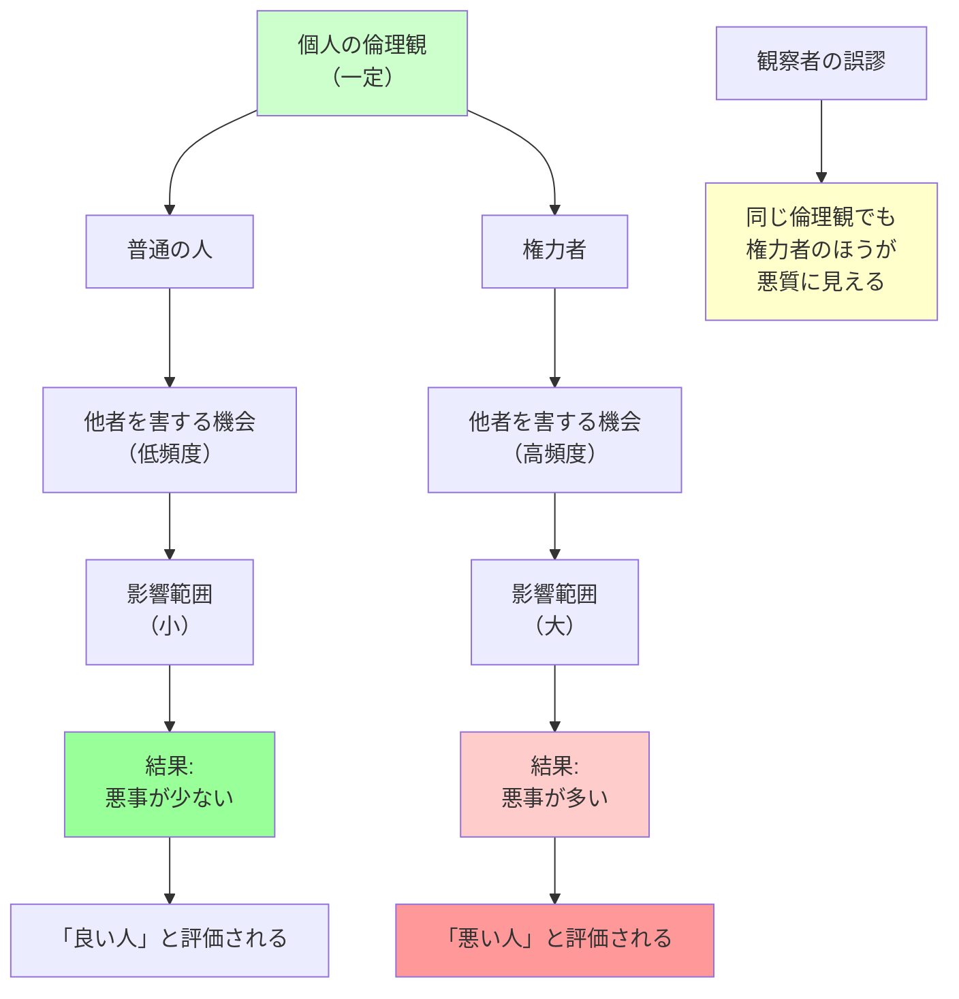

## 要約（Summary）

- 権力を握ると、他者を害しうる**機会**が自ずと増え、判断を誤ると、より多くの人が苦しむ
- 権力者が悪質に見えるのは、必ずしも腐敗したからではなく、悪行を働く機会と結果の重大性が増しただけかもしれない
- 普通の人は道徳的ジレンマを避けることができるが、権力者はそれに直面する頻度が高く、その決定の影響範囲も大きい

## 本文（Body）

### 背景・問題意識

私たちは、誰かが「悪い人間」かどうかを、**どれだけ頻繁に悪質なことをするか**によって判断する傾向がある。しかし、この判断には重大な見落としがある。それは、**悪質な振る舞いをしたり他者を傷つけたりしやすい機会に、人がどれだけ頻繁に直面するか**を考慮に入れていないことだ。

権限のある地位に就けば、悪行を働く機会が自ずと増え、その悪影響も増す。権力者が普通の人より悪質に見えるのは、性格が悪いからではなく、**機会と影響範囲が大きいから**かもしれない。

### アイデア・主張

**権力と機会の関係**：

1. **機会の非対称性**：
   - **普通の人**：他者の運命を決める状況にほとんど直面しない
   - **権力者**：日常的に他者の人生を左右する決定を迫られる
   - 同じ倫理観を持っていても、権力者のほうが「悪事」を働く機会が多い

2. **影響範囲の拡大**：
   - 普通の人の判断ミス：自分や身近な人に影響
   - 権力者の判断ミス：数百、数千、数万人に影響
   - 結果の重大性が異なるため、同じ程度のミスでも評価が大きく変わる

3. **道徳的ジレンマへの曝露頻度**：
   - 普通の人：道徳的に完璧な選択肢を選ぶか、決定を他者に委ねることができる
   - 権力者：道徳的に完璧な選択肢がない状況で決断を迫られる頻度が高い

4. **責任の帰属**：
   - 権力者が「悪事」を働いたとき、それは個人の性格ではなく、**役割に付随する機会**の結果である可能性がある
   - 誰がその役割に就いても、同様の決定を迫られる

### 内容を視覚化するMermaid図

### 具体例・ケース

**ハリケーン・カトリーナとポウ医師**：
- 2005年、ニューオーリンズの病院でハリケーン・カトリーナに被災
- ポウ医師は患者のトリアージ（選別）を行い、重篤な患者に致死量の薬物を投与
- もしポウが医師ではなく、用務員か警備員だったなら、このような決定を迫られることはなかった
- **権限のある地位に就いていたために、彼女は害をなす機会を得た**
- これは彼女が悪質だからではなく、役割が機会を与えたから

**企業のCEOとリストラ決定**：
- CEO：数千人の雇用を左右するリストラ決定を下す機会が頻繁にある
- 一般社員：そのような決定を下す機会はない
- 同じ倫理観を持っていても、CEOのほうが「他者を害する」決定を下す頻度が高い
- CEOが批判されるのは、性格が悪いからではなく、役割が機会を与えるから

**政治家と政策決定**：
- 政治家：医療制度、福祉政策、外交政策など、数百万人の生活に影響する決定を下す
- 一般市民：そのような決定を下す機会はない
- 政策の判断ミスは多くの人を苦しめるが、それは政治家が悪質だからではなく、役割が大きな影響力を持つから

### 反論・限界・条件

**機会と性格の相互作用**：
- 権力者が機会を得ることで、実際に性格が変わる可能性もある
- 「権力による腐敗メカニズム」との区別が難しい
- 機会の増大と腐敗の両方が同時に起こっている可能性がある

**すべての権力者に当てはまるわけではない**：
- 権力を持っても、道徳的に正しい決定を一貫して行う人もいる
- 個人の倫理観や価値観は依然として重要

**機会を制約する制度設計の重要性**：
- 権力者に過度な機会を与えない制度設計（権力の分散、チェック&バランス）が重要
- 一人の人間に過度な決定権を集中させないことで、機会の増大を防げる

**責任の所在**：
- 「機会があったから仕方ない」という免罪符にはならない
- 権力者は依然として、自らの決定の結果に責任を負うべき
- ただし、評価する際には「機会の非対称性」を考慮すべき

## 関連ノート（Links）

- [[20251227072931-dirty-hands-problem-moral-dilemma|汚れた手の問題：権力者が直面する解決不能な道徳的ジレンマ]] - 機会が増えることで直面するジレンマ
- [[20251223233911-power-corrupts-mechanism|権力による腐敗メカニズム：権力が人の共感と行動を変える理由]] - 機会だけでなく、性格も変わるメカニズム
- [[20251223234018-system-design-prevent-power-corruption|権力腐敗を防ぐシステム設計の3要素：選抜・責任・監視]] - 機会を制約する制度設計
- [[20251223233758-power-seeking-self-selection-bias|権力への自己選択バイアス：不適切な人がリーダーになる構造]] - 誰が機会を得るかの問題
- [[20251226082726-institutional-quality-attracts-matching-people|制度の質が引き寄せる人材の質：腐敗の自己強化メカニズム]] - 制度が機会を形作る

## To-Do / 次に考えること

- [ ] 自社の権力構造で、特定の個人に過度な決定権が集中していないか分析する
- [ ] 権力者が道徳的ジレンマに直面する頻度を減らす制度設計（権力の分散、集団意思決定など）を検討
- [ ] 権力者の決定を評価する際に、「機会の非対称性」を考慮する評価基準を設計する
