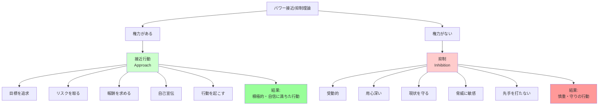

## 要約（Summary）

- 権力を持つと「接近」行動（行動を起こす、危険を冒す、報酬を求める）が増加し、権力がないと「抑制」（受動的、用心深い）される
- ケルトナーらが2003年に開発した「パワー接近/抑制理論」は、権力が人の行動に与える基本的な影響を説明する
- この理論は、権力者がより積極的で自信に満ち、リスクを取りやすくなる一方、無権力者は慎重で守りに入ることを示す

## 本文（Body）

### 背景・問題意識

権力は人をどう変えるのか？ 第二次世界大戦後、研究者たちは世界で解き放たれた邪悪を理解しようとし、権力の研究が体系化された。ミルグラムの電気ショック実験（1960年代）、ジンバルドーのスタンフォード監獄実験（1970年代）などを経て、2003年にケルトナーらが包括的な理論を打ち立てた。

### アイデア・主張

#### パワー接近/抑制理論の核心

**権力がある場合**：
- **接近行動（Approach）**が活性化される
- 行動を起こす、目標を追求する、危険を冒す、報酬を求める、自己宣伝をする
- ギャンブラーのような心理：「プレイしなければ勝てない」
- 勝つという自信が強まる

**権力がない場合**：
- **抑制（Inhibition）**が働く
- 先手を打たず受動的に行動する
- 用心深く、現状を守ろうとする
- 他者からの脅威や危険に敏感

#### 基本的なメカニズム

この理論は、権力の効果を2つの次元で説明する：

1. **行動の方向性**：
   - 接近 = 前向きに動く
   - 抑制 = 後ろ向きに守る

2. **心理的状態**：
   - 権力 → 報酬への感受性が高まる → 接近行動
   - 無権力 → 脅威への感受性が高まる → 抑制行動

### 内容を視覚化するMermaid図

### 具体例・ケース

**企業組織**：
- **経営層（権力あり）**：新規事業に投資、大胆な組織改革、リスクを取った戦略
- **一般社員（権力なし）**：現状維持、上司の指示を待つ、失敗を恐れて提案を控える

**政治**：
- **与党（権力あり）**：政策を積極的に推進、大胆な改革、批判を気にせず行動
- **野党（権力なし）**：与党の監視、批判、守りの姿勢

**日常生活**：
- **上司（権力あり）**：部下に指示、会議で積極発言、自分のアイデアを推進
- **部下（権力なし）**：上司の顔色を伺う、会議で発言を控える、リスクを避ける

**スポーツ**：
- **首位チーム（権力あり）**：攻撃的な戦術、リスクを取ったプレー
- **下位チーム（権力なし）**：守備的な戦術、失点を避ける

### 反論・限界・条件

**個人差の存在**：
- すべての人が同じように反応するわけではない
- 性格特性（外向性、神経症傾向など）によって、権力の効果は変わる

**文化的差異**：
- この理論は主にアメリカで研究された（WEIRD問題）
- 集団主義的な文化では、権力があっても接近行動が抑制される可能性

**状況依存性**：
- 権力の種類（公式vs非公式、正統性の有無など）によって効果が異なる
- 組織文化や制度的制約も影響する

**短期vs長期**：
- この理論は主に短期的な影響を扱う
- 長期的には権力による腐敗など、より複雑な変化が起こる

**因果関係の方向**：
- 権力が接近行動を促すのか、接近的な人が権力を得るのか（自己選択）
- 両方向の因果関係が存在する可能性

## 関連ノート（Links）

- [[20251227084141-power-paradox-keltner|権力のパラドックス]] - この理論が示す接近行動が美徳を蝕むメカニズム
- [[20251227084314-power-illusory-control-risk-taking|権力による錯覚的制御とリスクテイク行動の増加]] - 接近行動の具体的な現れ（リスクテイク）
- [[20251227084451-power-empathy-decline-disinhibition|権力による共感能力と道徳的抑制の低下]] - 接近行動の具体的な現れ（抑制の喪失）
- [[20251227084631-power-corruption-iceberg-model|権力腐敗の氷山モデル]] - この理論は氷山の一角（権力による腐敗）を説明する
- [[20251223233758-power-seeking-self-selection-bias|権力への自己選択バイアス]] - 接近的な人が権力を求める傾向（因果の逆方向）
- [[20251223234018-system-design-prevent-power-corruption|権力腐敗を防ぐシステム設計の3要素]] - 接近行動の暴走を制度で抑制する対策

## To-Do / 次に考えること

- [ ] 自分の職場で、権力のある人とない人の行動パターンを観察し、この理論が当てはまるか確認
- [ ] 接近行動が過度に働いている兆候（無謀なリスクテイク、他者の意見を聞かない）がないかチェック
- [ ] 抑制が過度に働いている兆候（イノベーションの欠如、受動性）を特定し、権力の再配分を検討
- [ ] 文化的差異を考慮し、日本企業でこの理論がどう修正されるべきか考察
