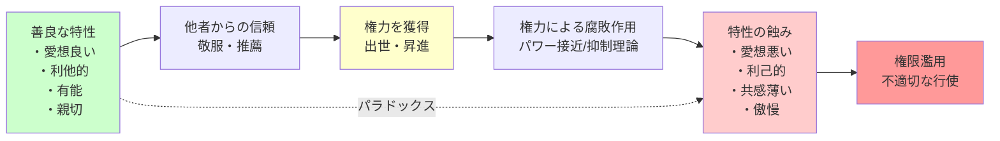

## 要約（Summary）

- 善良な人（愛想が良く、利他的で、有能で、親切）は権力を得やすいが、権力を得るとその特性が蝕まれる
- 出世を助けた美徳（共感、協調性、誠実さ）が、権力の持つ腐敗作用によってたちまち損なわれるという矛盾
- ケルトナーが2016年に提唱した「権力のパラドックス」は、権力の取得と行使の間に構造的な矛盾があることを示す

## 本文（Body）

### 背景・問題意識

なぜ優れたリーダーが権力を握った後に変わってしまうのか？ この問いに対し、ダーチャー・ケルトナーは2016年に『権力のパラドックス』で答えを示した。それは、**権力を得る過程と権力を持った後では、求められる特性が正反対になる**という構造的矛盾だ。

### アイデア・主張

#### パラドックスの構造

**第1段階：権力の取得**

善良な特性を持つ人が権力を得やすい：
- **愛想が良い**：他者が好意を持つ
- **利他的**：チームのために尽くす
- **有能**：実績を残す
- **親切**：他者を助ける

これらの特性が：
1. 他者からの敬服を生む
2. 信頼を獲得する
3. 上司に推薦される
4. 結果として出世する

**第2段階：権力による変容**

権力を握ると、出世を助けた特性が蝕まれる：
- **愛想が悪くなる**：他者の話を遮る、無礼になる
- **利己的になる**：自己利益を優先
- **共感が薄れる**：他者の心を読めなくなる
- **傲慢になる**：規則は自分には当てはまらないと感じる

#### パラドックスの核心

```
善良さ → 権力を獲得 → 権力による腐敗 → 善良さの喪失
```

つまり：
- 権力を得るためには善良である必要がある
- しかし権力を得ると善良でなくなる
- これは**構造的な矛盾**であり、個人の資質の問題ではない

### 内容を視覚化するMermaid図



### 具体例・ケース

**企業のマネージャー**：
- **昇進前**：チームメンバーをサポート、他者の意見を尊重、謙虚に学ぶ
- **昇進後**：部下の話を聞かない、自分の判断を押し付ける、失敗を他者のせいにする
- 部下が「昔のあの人はどこへ行った？」と嘆く

**政治家**：
- **選挙前**：有権者に寄り添い、地域の声を聞き、公約を守ると誓う
- **当選後**：有権者を無視、利益団体に取り込まれる、公約を破る
- 有権者が「選挙のときだけだった」と失望する

**学者**：
- **若手時代**：謙虚に学び、他者の研究を尊重、協力的
- **権威を得た後**：他者の批判を受け入れない、自説に固執、傲慢になる
- 学会で「老害」と呼ばれる

**スタートアップ創業者**：
- **創業期**：従業員と対等に議論、フラットな組織、ビジョンを共有
- **成長後**：独断専行、従業員の意見を聞かない、ワンマン経営
- 初期メンバーが「会社が変わってしまった」と去る

### 反論・限界・条件

**すべての権力者が変わるわけではない**：
- 権力を得ても謙虚さを保つリーダーも存在する
- 個人の価値観や自己認識の強さによって、パラドックスの影響度は異なる

**文化的・組織的要因**：
- ケルトナーの研究は主にアメリカの文化・組織を対象
- 集団主義的な文化や、強い監視システムがある組織では、パラドックスは弱まる可能性

**「善良さ」の定義**：
- 何が「善良」かは文化や状況によって異なる
- 表面的な愛想の良さと、本質的な倫理性は別物

**権力の種類による違い**：
- 正統性のある権力（選挙で選ばれた）と、強制的な権力（クーデター）では効果が異なる
- 一時的な権力と、長期的な権力でも影響は変わる

**制度設計で緩和可能**：
- パラドックスは避けられないが、制度設計（選抜・責任・監視）で影響を抑制できる
- 権力の分散、任期制限、定期評価などが有効

## 関連ノート（Links）

- [[20251227084017-power-approach-inhibition-theory|パワー接近/抑制理論]] - 権力が人を変えるメカニズム（パラドックスの第2段階）
- [[20251223233758-power-seeking-self-selection-bias|権力への自己選択バイアス]] - 対比：悪質な人が権力を求める別の経路
- [[20251223234018-system-design-prevent-power-corruption|権力腐敗を防ぐシステム設計の3要素]] - パラドックスへの対策
- [[20251227073223-power-opportunity-expansion|権力と機会の増大]] - 権力を得ることで悪行の機会も増える
- [[20251226035625-stanford-prison-experiment-critical-revaluation|スタンフォード監獄実験の批判的再評価]] - 権力が人を変える実験的証拠

## To-Do / 次に考えること

- [ ] 自分や同僚が昇進したとき、どのように変化したか振り返る
- [ ] 権力を得ても美徳を保っているリーダーの特徴（自己認識、謙虚さ、フィードバック受容）を観察
- [ ] 組織内で、昇進後のリーダーを定期的に評価し、フィードバックする仕組みを提案
- [ ] 自分が権力を得たとき、パラドックスに陥らないためのセルフチェックリストを作成
