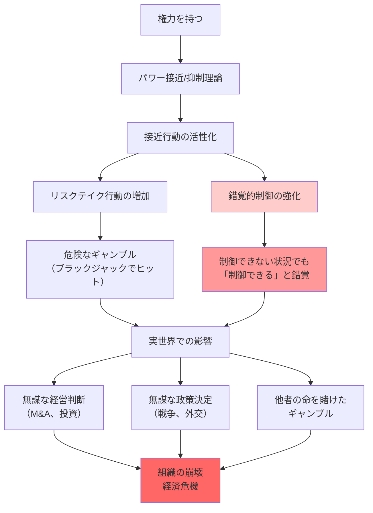

## 要約（Summary）

- 権力を持つと危険を冒す行動が増加し、リスクの高い選択をする傾向が強まる
- 権力者は、制御できない状況でも制御できると錯覚する（**錯覚的制御**）
- この錯覚により、権力者は自らの能力を過信し、他者の命を賭けたギャンブルさえ行う

## 本文（Body）

### 背景・問題意識

権力を持つと、なぜリーダーは無謀な決断をするのか？ 戦争、経営判断、政策決定において、権力者が過度なリスクを取り、悲惨な結果を招く事例は枚挙にいとまがない。

研究者たちは、権力がリスク認知にどのような影響を与えるかを実験的に調査した。その結果、明らかになったのは、**権力が危険を冒す行動を増やし、制御できないリスクさえも制御できると錯覚させる**という事実だった。

### アイデア・主張

#### 権力とリスクテイクの関係

**確固とした実験結果**：
- 権力を持つと、危険を冒す行動が増える
- 上司役を演じた人は、部下役を演じた人よりもブラックジャックでリスクの高い選択（ヒット）をする
- 権力があると感じる人ほど、危険なギャンブルに手を出しやすい

#### 錯覚的制御（Illusory Control）

**定義**：
- 実際には制御できない状況でも、自分には制御できると誤って信じること
- サイコロの出目、カードの引き、ランダムな結果など、運に左右される事象に対しても「自分の力で結果を変えられる」と感じる

**権力との関係**：
- 権力を持つと、錯覚的制御が強まる
- 客観的にはコントロールできないリスクでも、「自分なら管理できる」と過信する
- この過信が、無謀な決断につながる

#### 実世界での危険性

権力を持つ人が：
1. **自分にはリスクを管理する能力がある**と誤って思い込む
2. その誤信に基づいて**自らサイコロを振る**
3. **他者の命を賭けてギャンブル**をする

これが、戦争、経済危機、組織の崩壊につながる。

### 内容を視覚化するMermaid図

### 具体例・ケース

**ブラックジャック実験**：
- 参加者を上司と部下の役にランダムに割り振る
- その後、ブラックジャックをプレー
- **結果**：上司役の人は、リスクが高い状況でもヒット（カードを引く）する傾向が強い
- 部下役の人は、より慎重にスタンド（カードを引かない）を選ぶ

**企業のM&A**：
- 権力を持つCEOは、巨額のM&Aを「自分なら成功させられる」と過信
- 統計的には、M&Aの7割は失敗するが、CEOは「自分は例外」と考える
- 結果として、株主価値を毀損する無謀な買収が繰り返される

**戦争の決断**：
- 独裁者や権力者は、戦争のリスクを過小評価し、「短期間で勝てる」と錯覚
- 歴史的に、多くの戦争は指導者の過信から始まった
- ベトナム戦争、イラク戦争など、「制御可能」と誤信した結果の悲劇

**金融危機**：
- 2008年の金融危機前、ウォール街のCEOたちは複雑な金融商品のリスクを「管理可能」と過信
- 実際には制御不能なリスクの連鎖が起き、世界経済が崩壊

**スタートアップの拡大戦略**：
- 成功した創業者が、「次も成功できる」と過信し、無謀な拡大戦略を取る
- 資金を使い果たし、倒産するケースが多発

### 反論・限界・条件

**適度なリスクテイクは必要**：
- すべてのリスクテイクが悪いわけではない
- イノベーション、起業、成長には、適度なリスクテイクが不可欠
- 問題は「過度な」リスクテイクと「錯覚的制御」

**個人差の存在**：
- すべての権力者が錯覚的制御に陥るわけではない
- 謙虚さ、自己認識、過去の失敗経験などが、錯覚を抑制する

**状況による変動**：
- 権力の種類（正統性、安定性）や、組織文化（リスク許容度）によって影響度は変わる
- 監視が厳しい環境では、錯覚的制御は抑制される

**錯覚的制御の測定の難しさ**：
- 実験室での結果が、実世界の複雑な意思決定にどこまで当てはまるかは不明
- 実際の権力者は、専門家の助言や情報を得られるため、錯覚が修正される可能性もある

**制度設計で緩和可能**：
- チェック&バランス、集団意思決定、外部監査などで、個人の錯覚を抑制できる
- リスク管理の専門部署、独立した監査委員会などが有効

## 関連ノート（Links）

- [[20251227084017-power-approach-inhibition-theory|パワー接近/抑制理論]] - 権力が接近行動（リスクテイク）を促すメカニズム
- [[20251227084141-power-paradox-keltner|権力のパラドックス]] - 権力を得ることで謙虚さが失われ、過信が生まれる
- [[20251227073223-power-opportunity-expansion|権力と機会の増大]] - リスクテイクの機会も権力とともに増える
- [[20251223234018-system-design-prevent-power-corruption|権力腐敗を防ぐシステム設計の3要素]] - 錯覚的制御への制度的対策
- [[20251226082726-institutional-quality-attracts-matching-people|制度の質が引き寄せる人材の質]] - 制度がリスクテイク行動を制約する

## To-Do / 次に考えること

- [ ] 自社の重要な意思決定で、リーダーの過信や錯覚的制御が働いていないか振り返る
- [ ] 大きなリスクを伴う決定（M&A、新規事業、組織改革）で、複数の独立した評価を義務付ける仕組みを検討
- [ ] 「自分なら成功できる」という過信の兆候（過去の成功体験への過度な依存、反対意見の無視）を観察
- [ ] リスク管理の専門家や外部監査の意見を、意思決定に組み込むプロセスを設計
