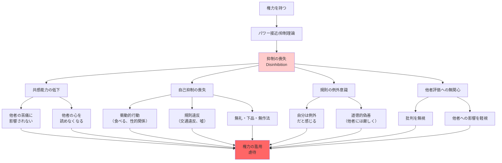

## 要約（Summary）

- 権力を持つと、他者の苦痛や感情に対する共感が薄れ、影響を受けにくくなる
- 自己を抑制する力（self-control）を失い、衝動的な行動が増える（「権力に酔う」）
- 他者にどう思われるかを気にせず、規則は自分には当てはまらないと感じるようになる

## 本文（Body）

### 背景・問題意識

ケルトナーの研究は、権力が人の共感能力と自己抑制に与える影響を明らかにした。「権力に酔う」という表現は、単なる比喩ではなく、**科学的に実証された現象**である。

権力のある人は、他者の心をうまく読めなくなり、共感する必要を感じなくなる。そして、自分を抑制する力を失い、規則や道徳は自分には当てはまらないと考えるようになる。

### アイデア・主張

#### 権力が共感能力に与える影響

**2008年の実験**：
- 参加者に、自分に痛みや苦しみを引き起こした人生の出来事について1対1で話し合わせる
- 散々な目に遭った話、心に傷を負うような体験を聞かせる
- **結果**：権力があると思っている人ほど、他者の苦しみに影響を受けなかった
- 同情することも少なかった

**他者の心を読む能力の低下**：
- 権力を持つと、他者の感情や意図を正確に読み取る能力が低下する
- 他者の立場に立って考える必要を感じなくなる
- 結果として、コミュニケーションが一方的になる

#### 自己抑制の喪失：「権力に酔う」

**ケルトナーの発見**：
権力のある人は、自分を抑制する力を失う傾向にある。具体的には：

- **衝動的に食べる**
- **性的な関係を持つ**
- **交通規則を破る**
- **嘘をつく**
- **騙す**
- **万引きをする**
- **子どもからキャンディを取り上げる**
- **失礼な口、下品な口、無作法な口を利く**

#### 規則の例外意識

権力を持つと：
- 「規則は自分には当てはまらない」と感じる
- 他者に厳しい基準を要求しつつ、自分は例外だと考える
- 道徳的偽善（moral hypocrisy）：他者には道徳を説きながら、自分は破る

#### 他者の評価への無関心

- 他者にどう思われるかを気にしなくなる
- 批判やフィードバックを無視する
- 自分の行動が他者に与える影響を軽視する

### 内容を視覚化するMermaid図

### 具体例・ケース

**他者の苦痛への無関心**：
- **部下のリストラ**：CEOがリストラを決定する際、解雇される人々の苦しみに共感しない
- **医療政策**：政治家が医療費削減を決定する際、病人の苦しみを軽視
- **戦争決定**：指導者が戦争を決定する際、兵士や市民の死を「必要な犠牲」と冷淡に扱う

**自己抑制の喪失**：
- **政治家のスキャンダル**：権力者による性的スキャンダル、不倫、セクハラ
- **企業幹部の横領**：「これくらい許される」という感覚で公金を私的に使う
- **交通違反**：権力者が駐禁や速度違反を「自分は急いでいるから」と正当化

**規則の例外意識**：
- **パンデミック中の会食**：政治家が「国民には自粛を要請」しながら、自分は会食
- **税金逃れ**：富裕層が「法の抜け穴」を利用して税金を逃れ、「合法だから問題ない」と主張
- **社内規則の無視**：経営層が「自分は特別」と感じ、服装規定やコンプライアンス規則を無視

**道徳的偽善**：
- **不倫を批判する政治家が自ら不倫**
- **環境保護を訴える経営者がプライベートジェットで移動**
- **倫理を説く宗教指導者が金銭スキャンダル**

### 反論・限界・条件

**すべての権力者が共感を失うわけではない**：
- 権力を持っても共感的なリーダーも存在する
- 個人の価値観、育ち、自己認識によって影響度は異なる

**権力の種類による違い**：
- 正統性のある権力（選挙で選ばれた）と、強制的な権力では影響が異なる
- 他者との関係性（親密さ、依存度）によっても共感の低下度は変わる

**文化的差異**：
- 集団主義的な文化では、権力者でも他者への配慮が強く求められる
- 文化が共感の低下を抑制する可能性がある

**制度設計で緩和可能**：
- 定期的なフィードバック、360度評価、外部監査などで、自己抑制を促せる
- 規則の例外を認めない厳格な制度が、偽善を防ぐ

**短期vs長期**：
- 短期的な権力では影響が小さい可能性
- 長期的に権力を持つほど、共感の低下と抑制の喪失が進む

## 関連ノート（Links）

- [[20251227084017-power-approach-inhibition-theory|パワー接近/抑制理論]] - 抑制の喪失を説明する理論的基盤
- [[20251227084141-power-paradox-keltner|権力のパラドックス]] - 共感と親切さが権力で失われるパラドックス
- [[20251227031856-psychopath-unfairness-perception|サイコパスの不公平性認知]] - 共感の欠如がもたらす認知の歪み
- [[20251223234018-system-design-prevent-power-corruption|権力腐敗を防ぐシステム設計の3要素]] - 共感の低下への制度的対策
- [[20251226082846-human-cooperation-instinct-fairness-development|人間の協力本能と公平性の発達]] - 通常の人が持つ共感能力と公平性への配慮

## To-Do / 次に考えること

- [ ] 自社のリーダーが、部下の意見を聞かなくなった、批判を無視するようになった、などの兆候がないか観察
- [ ] 権力者が「自分は例外」と感じている兆候（規則違反、特権意識）を特定し、制度で抑制する方法を検討
- [ ] 定期的な360度評価やフィードバックを導入し、権力者が他者の視点を取り戻す機会を作る
- [ ] 共感トレーニング（他者の苦しみに触れる機会、現場訪問など）を権力者に義務付けることを検討
