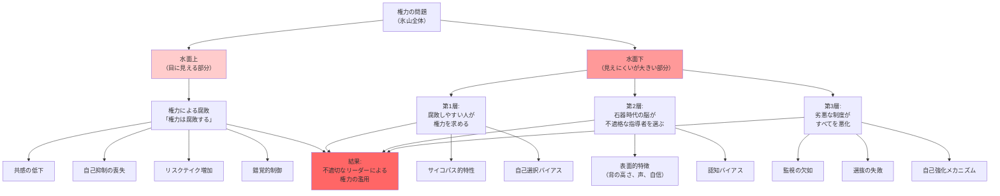

## 要約（Summary）

- 「権力は腐敗する」という通念は**氷山の一角**：権力を持った後の変化しか見ていない
- **水面下には、より大きな危険**が潜む：腐敗しやすい人が権力に引き寄せられ、石器時代の脳が不適格な指導者に従う
- 全体像を理解するには、権力獲得後の腐敗と、権力獲得前の選択バイアスの両方を見る必要がある

## 本文（Body）

### 背景・問題意識

アクトン卿の「権力は腐敗する」という格言は正しい。しかし、**それは全体像のほんの一部にしか光を当てていない**。

私たちは氷山の一角、すなわち**目にすることのできる、権力のある人々**にこだわる。だが、氷山の一角に焦点を当てれば、**水面下に潜んでいる、はるかに大きな危険**を見落とすことになる。

### アイデア・主張

#### 氷山の構造

**氷山の一角（水面上）：権力による腐敗**
- 目に見える部分
- 権力を持った後に起こる変化：
  - 共感能力の低下
  - 自己抑制の喪失
  - リスクテイクの増加
  - 錯覚的制御
- これが「権力は腐敗する」という通念

**氷山の水面下：権力への選択バイアスと認知バイアス**
- 見えにくいが、より大きく、より危険な部分
- 3つの層：

**第1層：腐敗しやすい人が権力に引きつけられる**
- サイコパス的特性を持つ人が権力を求める
- 権力を手にするのが得意（操作性、自己宣伝、冷酷さ）
- 自己選択バイアス

**第2層：石器時代の脳が不適格な指導者に従う**
- 人間は不合理な理由で不適格な指導者に引きつけられる：
  - 背が高い
  - 声が低い
  - 自信に満ちている
  - 男性的
- これらは実際の能力とは無関係だが、石器時代の脳は「強いリーダー」と誤認する
- 表面的特徴バイアス

**第3層：劣悪な制度が何もかもを悪くする**
- 制度設計の欠陥が、不適格な人を選び、権力者を監視せず、腐敗を許す
- 制度の質が低いと、悪い人材を引き寄せる（自己強化メカニズム）

#### 全体像の理解

権力の問題を理解するには、以下の両面を見る必要がある：

1. **権力は人を腐敗させる**（氷山の一角）
   - パワー接近/抑制理論
   - 権力のパラドックス
   - 共感の低下、リスクテイク増加

2. **不適切な人が権力を握る**（氷山の水面下）
   - 自己選択バイアス
   - 認知バイアス（石器時代の脳）
   - 劣悪な制度

両方を理解して初めて、「なぜ悪人が上に立つのか」という問いに答えられる。

### 内容を視覚化するMermaid図

### 具体例・ケース

**企業の不祥事**：
- **水面上（権力による腐敗）**：CEOが権力を濫用し、不正会計、横領を行う
- **水面下（選択バイアス）**：
  - そもそも、倫理観の低い人が「稼げるから」とその業界を選んだ
  - 面接で、背が高く自信に満ちた候補者を選んだ（能力ではなく）
  - 内部告発制度がなく、不正を監視する仕組みがなかった

**独裁政権**：
- **水面上（権力による腐敗）**：独裁者が権力を握った後、残虐になり、国民を弾圧
- **水面下（選択バイアス）**：
  - 権力欲の強い人がクーデターを起こし、権力を奪取
  - 国民が「強いリーダー」という外見に騙され、支持した
  - 民主的な制度が弱く、独裁者を止める仕組みがなかった

**学界の権威主義**：
- **水面上（権力による腐敗）**：権威ある教授が、批判を受け入れず、若手を抑圧
- **水面下（選択バイアス）**：
  - 権力志向の強い人が学界に残り、競争に勝った
  - 選考で、声が大きく自信に満ちた候補者を選んだ
  - 学界の制度が階層的で、権力者の監視が弱い

**スタートアップの失敗**：
- **水面上（権力による腐敗）**：創業者が成功後、傲慢になり、社員の意見を聞かなくなる
- **水面下（選択バイアス）**：
  - リスクテイクが好きな人が起業を選んだ（慎重な人は選ばない）
  - 投資家が「カリスマ性」で創業者を選んだ（実績ではなく）
  - ガバナンスが弱く、創業者を止める仕組みがなかった

### 反論・限界・条件

**すべての権力者が不適格というわけではない**：
- 氷山モデルは、不適格な人が権力を握る**傾向**を説明するが、すべてのケースに当てはまるわけではない
- 適切な選抜と監視があれば、適格な人が権力を握り、腐敗を避けられる

**制度設計で改善可能**：
- 氷山の水面下の問題は、制度設計で大幅に改善できる
- 選抜（多面評価、実績重視）、責任（透明性、任期制限）、監視（独立監査）

**文化的差異**：
- 「石器時代の脳」が反応する特徴は、文化によって異なる可能性
- 集団主義的な文化では、協調性や謙虚さが評価されるかもしれない

**完璧な解決策はない**：
- 氷山の一角も水面下も、完全に解決することはできない
- 人間の認知バイアスは根深く、制度設計も完璧ではない
- 継続的な改善と監視が必要

## 関連ノート（Links）

- [[20251223233758-power-seeking-self-selection-bias|権力への自己選択バイアス]] - 氷山の水面下（第1層）の詳細
- [[20251227084017-power-approach-inhibition-theory|パワー接近/抑制理論]] - 氷山の一角（権力による腐敗）のメカニズム
- [[20251227084141-power-paradox-keltner|権力のパラドックス]] - 氷山の一角（善良さの喪失）
- [[20251227084451-power-empathy-decline-disinhibition|権力による共感能力と道徳的抑制の低下]] - 氷山の一角（共感の喪失）
- [[20251223234018-system-design-prevent-power-corruption|権力腐敗を防ぐシステム設計の3要素]] - 氷山全体への対策

## To-Do / 次に考えること

- [ ] 自社の権力構造を氷山モデルで分析：水面上の腐敗と水面下の選択バイアスの両方を特定
- [ ] 採用や昇進のプロセスで、「石器時代の脳」が働いていないか（背の高さ、自信、外見で判断）確認
- [ ] 制度設計の改善（選抜・責任・監視）で、氷山の水面下の問題を軽減する方法を検討
- [ ] 組織内で、「権力の問題は個人の資質ではなく、構造の問題」という理解を広める
