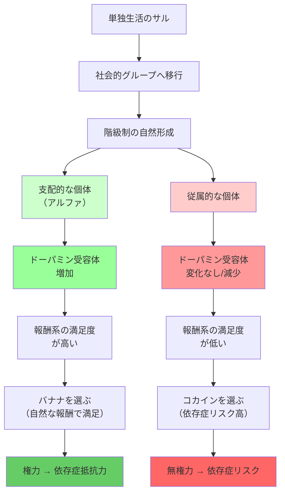

## 要約（Summary）

- 社会的地位が変化すると、脳内のドーパミン受容体の割合と数が変化する
- 支配的な地位にあるサルは、従属的なサルよりもドーパミン受容体が増加し、薬物依存になりにくい
- 階級制を生み出すだけで、脳の化学構造が生物学的に変化する

## 本文（Body）

### 背景・問題意識

権力や社会的地位は、単に心理的な影響を与えるだけでなく、**脳の生物学的構造そのものを変える**可能性がある。エモリー大学のマイケル・ネイダーらの研究は、この衝撃的な事実を霊長類の実験で明らかにした。

階級制と地位が、脳内の報酬系（ドーパミン受容体）に与える影響を調べることは、権力が人間の行動を変えるメカニズムを理解する上で極めて重要である。なぜなら、薬物依存は人間には社会階層次第で異なる影響を与えるように見えるからだ。

### アイデア・主張

#### サルの階級制実験

**実験デザイン**：
- 単独で暮らしているサルたちを社会的なグループに移行させる
- 自然に階級制が形成され、支配的な個体（アルファ）と従属的な個体が生まれる
- その後、脳をスキャンしてドーパミン受容体の変化を測定

**結果**：
- **階級制を生み出すだけで、ドーパミン受容体の割合と数が変わる**
- 支配的になったサルは、ドーパミン受容体が増加
- その結果、コカインが手に入るようになったとき、**手に入れる行動があまり強化されない**

#### 薬物依存への影響

**報酬の量と依存症の関係**：
- **報酬が多い場合**：すべてのサル（人間も）がコカインを選ぶ
- **報酬が少ない・ほどほどの場合**：
  - 従属するサルは、バナナよりもコカインを選ぶ率がずっと高い
  - 支配的なサルは食べ物（バナナ）を選ぶ

**解釈**：
- 権力があまりないサルは依存症になることが多い
- 支配的なサルは依存症になりにくい
- 社会的地位が低いと、脳の報酬系が変化し、薬物への依存が強まる

#### 人間への示唆

サルが権力を手にして支配的になると、脳内で化学物質の組み合わせが変わる。同じ霊長類の仲間である人間が、他者に対する支配権を得たときに、**生物学的な変化を起こさなかったら驚きだ**。

この研究は、権力と地位が単なる心理的現象ではなく、**脳の物理的構造を変える**ことを示している。

### 内容を視覚化するMermaid図

### 具体例・ケース

**低所得層の薬物依存**：
- 社会階層が低い人ほど、薬物依存やアルコール依存になりやすい
- これは単なる環境要因ではなく、**脳の報酬系が社会的地位によって変化している**可能性
- 従属的な立場に置かれることで、ドーパミン受容体が変化し、依存症リスクが高まる

**権力者の依存症パターン**：
- 権力者も依存症になるが、パターンが異なる
- 権力を失った後に依存症になるケースが多い（ドーパミン受容体の変化）
- 支配的な地位にある間は、自然な報酬（仕事の成功、社会的承認）で満足できる

**職場のストレスと依存**：
- 低い地位で裁量権がない仕事ほど、依存症リスクが高い
- 管理職でも、裁量権が少ない場合は依存症リスクが上がる
- 脳の報酬系が満たされないと、外部の刺激（薬物、アルコール）に頼る

**子どもの地位と脳の発達**：
- 学校での地位（いじめられている、人気がない）が脳の発達に影響
- 低い社会的地位が、報酬系の発達を阻害する可能性
- これが、将来の依存症リスクを高める

### 反論・限界・条件

**人間とサルの違い**：
- サルの実験結果が人間にそのまま当てはまるかは不明
- 人間の社会的地位はより複雑で、多次元的（経済、社会、文化）
- 人間の脳は、より高度な認知機能で報酬系を調整できる可能性

**因果関係の方向**：
- 地位が低いからドーパミン受容体が変化するのか
- もともとドーパミン受容体が少ない個体が従属的になりやすいのか
- 両方向の因果関係が存在する可能性

**可塑性と回復**：
- 脳の可塑性により、地位が変われば受容体も変化する可能性
- ネイダーの実験では、単独→グループ→支配的で変化が起きた
- つまり、地位を改善すれば受容体も回復する可能性がある

**他の要因の影響**：
- ストレス、栄養、運動、睡眠なども脳の化学構造に影響
- 社会的地位だけがドーパミン受容体を決めるわけではない

**依存症の複雑性**：
- 依存症は、遺伝、環境、トラウマなど多要因で決まる
- ドーパミン受容体だけで依存症は説明できない

## 関連ノート（Links）

- [[20251227084017-power-approach-inhibition-theory|パワー接近/抑制理論]] - 心理レベルでの権力の影響（こちらは脳の生物学レベル）
- [[20251227084314-power-illusory-control-risk-taking|権力による錯覚的制御とリスクテイク行動の増加]] - ドーパミン系の変化が行動に影響
- [[20251226083253-war-agriculture-hierarchy-emergence|戦争と農業が階級制社会を生んだメカニズム]] - 階級制の起源（この階級制が脳を変える）
- [[20251226083130-reverse-dominance-hierarchy|逆順位制]] - 平等社会では脳の変化が少ない可能性

## To-Do / 次に考えること

- [ ] 職場で低い地位・少ない裁量権の人が、依存症リスクにさらされていないか確認
- [ ] 組織設計で、裁量権と自律性を高め、脳の報酬系を満たす環境を作れないか検討
- [ ] 人間の社会的地位とドーパミン受容体の関係を調べた研究を探す
- [ ] 自分自身の地位の変化が、報酬への反応（仕事の満足感、達成感）にどう影響したか振り返る
