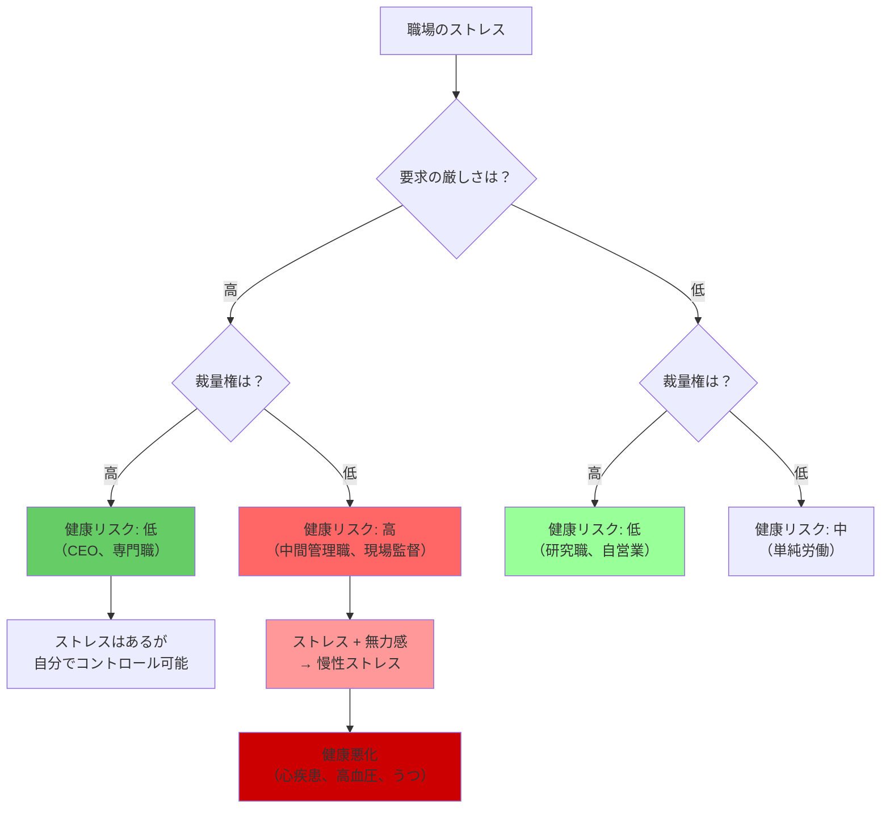

## 要約（Summary）

- 健康を決めるのはストレスの量ではなく、「厳しい要求」と「少ない裁量権」の組み合わせ
- マーモットの研究は、高い地位でも裁量権がなければ健康が悪化することを示した
- 「ステータス症候群」：社会的階層が低いほど死亡率が高いが、裁量権があれば緩和される

## 本文（Body）

### 背景・問題意識

従来の常識では、「高い地位の人はストレスが多く、健康が悪い」と考えられていた。しかし、ロンドン大学のマイケル・マーモットによる大規模な疫学調査（ホワイトホール研究）は、この常識を覆した。

マーモットは英国の公務員を対象に、階級と健康の関係を長期間追跡調査した。その結果、**階層が低いほど死亡率が高い**という「ステータス症候群」を発見した。さらに重要なのは、健康を左右するのはストレスの量ではなく、**裁量権の有無**だという発見だった。

### アイデア・主張

#### ステータス症候群：階級と死亡率の関係

**ホワイトホール研究の発見**：
- 階級制の上位ほど、死亡率が低い
- 最も低い階層にいて、そこにとどまっていた人は、より高い権力階層に上った人と比べて、**死亡率が3倍**
- これは、所得、医療アクセス、生活習慣だけでは説明できない

#### 裁量権こそが鍵：二軸モデル

マーモットが従来の「ストレス量」仮説に疑問を持ち、「裁量権」に焦点を当てた結果、新たな洞察が得られた：

**二軸モデル**：
1. **要求（Demand）**：仕事のプレッシャー、責任、厳しさ
2. **裁量権（Control）**：自分で決定できる範囲、自律性

**健康への影響**：
- **高要求 × 高裁量権**：健康に問題なし（経営者、専門職）
- **高要求 × 低裁量権**：健康悪化のリスク大（中間管理職、現場監督）
- **低要求 × 高裁量権**：健康に良い（研究職、自営業）
- **低要求 × 低裁量権**：健康に影響（単純労働）

**重要な洞察**：
> 「厳しい要求と少ない裁量権の組み合わせが問題なのです」

途方もないプレッシャーに直面している人は、**自分には大きな裁量権があると感じているかぎり大丈夫**だった。ところが、多くのプレッシャーにさらされていると感じ、しかも、**自分が運転席に座っていると感じていない**人は、健康状態が段違いに悪かった。

#### 独裁者である必要はないが

私たちは独裁者である必要はないが、**自分の職業人生における決定は自ら下せると感じている必要がある**。

これは、権力そのものよりも、**自律性と自己決定感**が健康に重要であることを示している。

### 内容を視覚化するMermaid図

```mermaid
quadrantChart
    title 職務要求度と裁量権による健康リスクのマトリクス
    x-axis 低裁量権 --> 高裁量権
    y-axis 低要求 --> 高要求
    quadrant-1 健康リスク: 小
    quadrant-2 健康リスク: 大
    quadrant-3 健康リスク: 中
    quadrant-4 健康リスク: 小
    経営者・CEO: [0.75, 0.85]
    酷使される中間管理職: [0.25, 0.85]
    専門職・研究者: [0.75, 0.65]
    裁量権のない現場労働者: [0.25, 0.45]
    自営業: [0.85, 0.55]
    用務員（低裁量権）: [0.15, 0.35]
```



### 具体例・ケース

**中間管理職のストレス**：
- 上からの厳しい要求（売上目標、コスト削減）
- 下からの要望（人員増、給与改善）
- 自分では決められない（裁量権が少ない）
- **結果**：心疾患、高血圧、うつ病のリスクが高い

**CEO vs 中間管理職**：
- **CEO**：プレッシャーは大きいが、裁量権も大きい → 健康リスクは低い
- **中間管理職**：プレッシャーは大きいが、裁量権が少ない → 健康リスクが高い

**用務員 vs 自営業の清掃業者**：
- **用務員**：裁量権なし、指示に従うだけ → 健康リスク中
- **自営業の清掃業者**：裁量権あり、自分で仕事を決められる → 健康リスク低

**IT業界のプロジェクトマネージャー**：
- 厳しい納期、バグ対応、クライアント要求（高要求）
- 技術選択、スケジュール調整、チーム編成の権限なし（低裁量権）
- **結果**：バーンアウト、離職率が高い

**医療現場の看護師**：
- 患者の命を預かる責任、長時間労働（高要求）
- 治療方針は医師が決定、勤務シフトも自分で決められない（低裁量権）
- **結果**：燃え尽き症候群、離職が多い

**コールセンターのオペレーター**：
- 厳しいKPI（対応時間、満足度）、クレーム対応（高要求）
- スクリプトに従うだけ、自分で判断できない（低裁量権）
- **結果**：ストレス、健康問題が多発

### 反論・限界・条件

**個人差の存在**：
- 同じ要求と裁量権でも、個人の性格（コントロール欲求、完璧主義など）で影響度が変わる
- レジリエンス（回復力）の高い人は、低裁量権でも健康を維持できる

**裁量権の主観性**：
- 客観的な裁量権と、主観的に感じる裁量権は異なる
- 「自分には裁量権がある」と感じられるかが重要
- 同じ職務でも、認知の仕方で健康への影響が変わる

**文化的差異**：
- この研究は主にイギリスで行われた
- 集団主義的な文化では、裁量権よりも集団の調和が重要かもしれない
- 日本では「自分で決める」ことが必ずしもポジティブではない可能性

**他の要因の影響**：
- 社会的支援（同僚、上司、家族）
- 仕事の意義（やりがい、社会貢献）
- 経済的報酬
- これらも健康に影響する

**裁量権の種類**：
- どのような裁量権が重要か（スケジュール、方法、目標設定）
- すべての裁量権が同じ効果を持つわけではない

**短期vs長期**：
- 短期的には低裁量権でも適応できる
- 長期的には慢性ストレスとなり健康を害する

## 関連ノート（Links）

- [[20251227101314-power-changes-dopamine-receptors|社会的地位が脳のドーパミン受容体を変化させるメカニズム]] - 生物学的基盤（こちらは疫学的発見）
- [[20251227084017-power-approach-inhibition-theory|パワー接近/抑制理論]] - 権力と行動の関係（こちらは健康への影響）
- [[20251129164131-control-expansion-task-management|タスク管理におけるコントロールの拡大]] - 裁量権を高める具体的手法
- [[20251226083130-reverse-dominance-hierarchy|逆順位制]] - 平等社会では裁量権が分散される

## To-Do / 次に考えること

- [ ] 自社の各職位で、要求と裁量権のバランスを分析する
- [ ] 健康問題（バーンアウト、離職）が多い部署で、裁量権が欠如していないか確認
- [ ] 中間管理職に、より多くの裁量権（予算、人事、スケジュール）を委譲できないか検討
- [ ] 裁量権を高める施策（フレックスタイム、リモートワーク、目標設定への参加）を導入
- [ ] 自分自身の仕事で、要求と裁量権のバランスを振り返る
