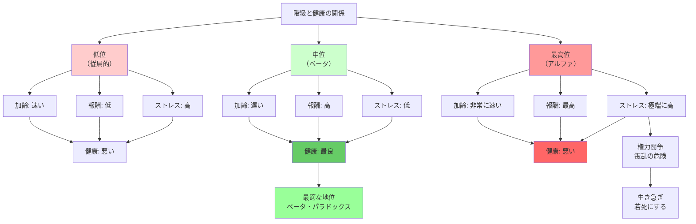
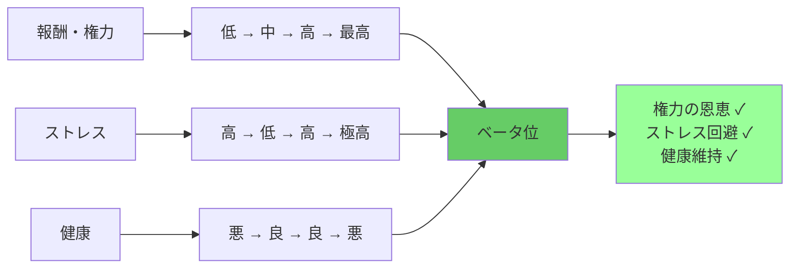

## 要約（Summary）

- 霊長類の研究では、最高位（アルファ）よりも2番手（ベータ）の方が生物学的に健康で長生きする
- アルファは権力闘争のストレスで加齢が速まり、極端なストレスにさらされる
- ベータは権力の恩恵を享受しつつ、頂点の危険を回避できる最適な位置

## 本文（Body）

### 背景・問題意識

従来の常識では、「頂点に立つこと」が最も望ましいとされてきた。しかし、霊長類の生物学的研究は、この常識に疑問を投げかける。

デューク大学のジェニー・タンらの研究は、ヒヒの遺伝子の加齢を調べ、階級と健康の関係を明らかにした。一方、プリンストン大学のローレンス・ジェスキエールらは、ストレスホルモンの測定から、**最も健康的な地位はアルファではなくベータである**という驚くべき結論に至った。

### アイデア・主張

#### ヒヒの階級と加齢の研究（タンら）

**実験デザイン**：
- 245頭のヒヒを捕獲し、遺伝子の加齢を調べる
- 集団内での社会的階級と比較

**予想された結果**：
- 階級が低いと加齢が速まる（食べ物が少ない、交尾相手が少ない）
- 階級が高いと加齢が遅くなる

**実際の結果**：
- **階級の高いオスのほうが、格段に速く加齢した**
- トップの座に上れば、交尾相手を見つけるうえで著しく優位になれるが、**その代償も著しく大きい**
- ヒヒにとってそれは、「**生き急ぎ、若死にする**」戦略

#### ストレスホルモンの測定（ジェスキエールら）

**グルココルチコイド（ストレスホルモン）の測定**：
- ある霊長類の個体が階級制の上に行けば行くほど、ストレスが少なくなる
- **ただし、1つ例外があった**：頂点に立つアルファオスは、極端なストレスにさらされていた

**ベータ位の優位性**：
> 占めるべき最善の地位は、アルファオスに次ぐベータオスの座だった。その地位にあれば、ヒヒの君主につき物の危険にさらされることなしに、権力の恩恵のすべてが手に入るからだ。

#### サポルスキーの説：権力闘争のストレス

ロバート・サポルスキーの研究は、アルファにとってトップの生活が、**権力闘争の間は特に、ストレスに満ちたものとなりうる**ことを立証した。

**単純明快な説**：
- ヒヒの王となるのは良いこと
- だが、**叛乱の危険があるときには**、ヒヒの小作農でいるのと同じぐらい、あるいはそれ以上にさえ、ストレスに満ちている

#### 人間への示唆：CEOのストレスと健康

イリノイ大学のマーク・ボーグシュルトらは、アメリカのCEOを対象に、ストレスと健康の関係を調べた。

**企業買収防止法の自然実験**：
- 1980年代後半、多くの州で企業買収防止法が制定された
- 法律により、CEOの地位が安泰になり、ストレスが減少
- **結果**：法が制定されてから権力の座で多くの時間を過ごしたCEOは、もっとストレスが多かった時期に権力の座にあったCEOよりも長生きした
- 「企業買収防止法によるストレスの軽減を経験した効果は、そのCEOを**2歳若返らせる**のにほぼ等しかった」

**業界危機とCEOの加齢**：
- 2008-09年の大不況に凄まじい打撃を受けた企業を経営していたCEO
- その後の10年間に**まる1年分速く加齢した**かに見えた
- 顔の写真をAIモデルで解析した結果

**政治家の寿命**：
- 『ブリティッシュ・メディカル・ジャーナル』誌の調査（17か国、数世紀）
- 選挙に勝って公職に就いた政治家は、次点で敗れて公職に就かなかった人よりも早く亡くなった

### 内容を視覚化するMermaid図

### 具体例・ケース

**企業組織**：
- **CEO（アルファ）**：最高の報酬、株主からのプレッシャー、解任リスク、激務 → 加齢が速い
- **COO・CFO（ベータ）**：高い報酬、重要な権限、CEOほどのプレッシャーはない → 健康的
- **平社員（低位）**：低い報酬、裁量権なし、ストレス → 健康問題

**政治**：
- **大統領・首相（アルファ）**：国家を背負う責任、批判の集中、暗殺リスク → 在任中に急速に老化
- **副大統領・副首相（ベータ）**：影響力はあるが、最終責任はない → より健康的
- **一般市民（低位）**：権力なし、経済的困窮 → 健康問題

**スポーツチーム**：
- **キャプテン（アルファ）**：チームの責任、批判の的、プレッシャー → バーンアウト
- **副キャプテン・エース級選手（ベータ）**：影響力あり、責任は分散 → パフォーマンス安定
- **控え選手（低位）**：出場機会少ない、評価されない → モチベーション低下

**歴史的人物**：
- **ローマ皇帝**：暗殺、毒殺、クーデターのリスク → 平均在位期間が短い
- **元老院議員**：権力はあるが、皇帝ほどのリスクはない → より長生き

**現代のCEO**：
- **買収リスクが高い時代のCEO**：ストレスで2歳分加齢
- **買収防止法後のCEO**：ストレス減少で2歳若返り
- **2008年金融危機のCEO**：10年間で1年分速く加齢

### 反論・限界・条件

**人間とヒヒの違い**：
- ヒヒの社会構造は単純で物理的な暴力が中心
- 人間の権力は、正統性、法、制度、文化などで複雑化
- 人間のアルファは、制度的保護（ボディガード、法律）で叛乱リスクを減らせる

**権力の安定性による違い**：
- 安定した権力（民主主義の任期制、企業の長期CEOなど）では、ストレスが少ない
- 不安定な権力（独裁者、買収リスクのあるCEO）では、ストレスが極端に高い
- ベータが最適なのは、アルファが不安定な場合のみかもしれない

**ベータの定義の曖昧さ**：
- 「ベータ」の範囲が不明確（2番手だけか、上位10%か）
- 組織によってベータの役割は異なる

**報酬とストレスのトレードオフ**：
- アルファは短命でも、遺伝子を多く残せる（生物学的成功）
- 人間の場合、富、名声、歴史的影響力などがトレードオフの対象
- 「健康」だけが最適化の目標ではない

**個人差の存在**：
- ストレスに強い人、権力闘争を楽しむ人もいる
- すべての人にとってベータが最適とは限らない

**短期vs長期**：
- 短期的にはアルファのストレスは高いが、適応すれば減少する可能性
- 長期的には権力の安定化で、アルファでも健康を維持できるかもしれない

## 関連ノート（Links）

- [[20251227101451-job-demand-control-health-model|職務要求度と裁量権の二軸モデル]] - アルファは要求が高く、脅威（叛乱）も高い
- [[20251227101314-power-changes-dopamine-receptors|社会的地位が脳のドーパミン受容体を変化させるメカニズム]] - 生物学的基盤
- [[20251227084314-power-illusory-control-risk-taking|権力による錯覚的制御とリスクテイク行動の増加]] - アルファのリスク行動
- [[20251226083253-war-agriculture-hierarchy-emergence|戦争と農業が階級制社会を生んだメカニズム]] - 階級制の起源
- [[20251227031857-psychopath-leadership-paradox|サイコパスのリーダーシップ・パラドックス]] - アルファの魅力と無能

## To-Do / 次に考えること

- [ ] 自社で、トップ（社長、事業部長）のストレスと健康状態を観察する
- [ ] ベータ的な役割（COO、ナンバー2）を強化し、CEOのストレスを分散できないか検討
- [ ] 自分自身のキャリアで、「ベータ位」を目指す戦略を考える（ナンバー2、専門職トップ）
- [ ] アルファのストレスを軽減する制度（権力の分散、集団意思決定、サポート体制）を設計
- [ ] 歴史的に成功したナンバー2（参謀、副大統領、COO）の事例を研究する
