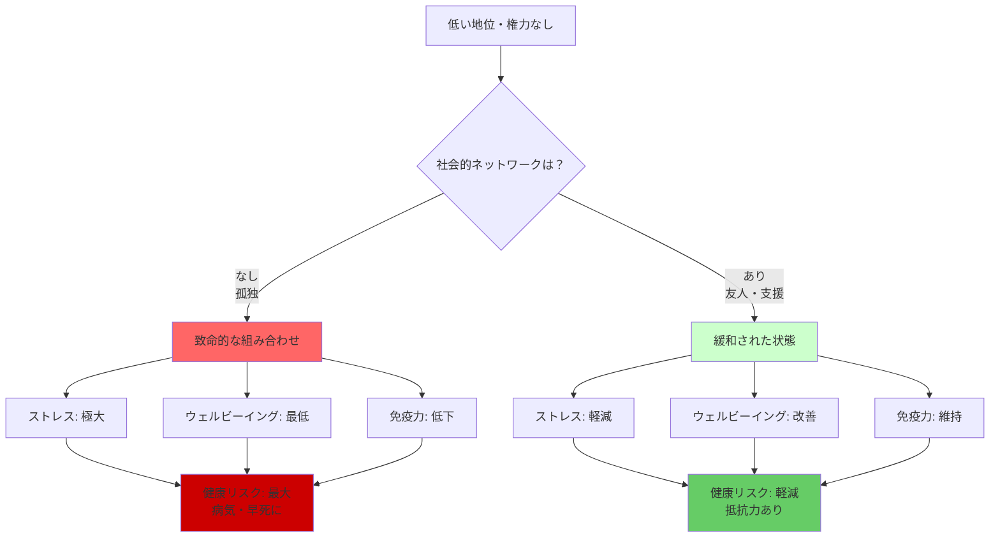
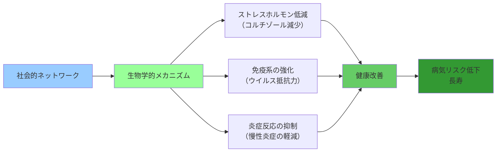

## 要約（Summary）

- 確固とした社会的ネットワーク（友人関係）を持つと、ストレスが減り、ウェルビーイングが改善し、健康が増進する
- 低い地位・無権力・孤独の組み合わせは致命的だが、友人の支援があれば緩和される
- 社会的つながりは、生物学的ストレス（免疫、病気抵抗力）に直接的な影響を与える

## 本文（Body）

### 背景・問題意識

権力や地位が健康に与える影響は大きいが、それがすべてではない。カーネギーメロン大学の研究者シェルドン・コーエンらの研究は、**社会的ネットワークが生物学的ストレスを緩和する**ことを実験的に示した。

この研究は、「友人がいる」という単純な事実が、免疫系や病気への抵抗力に直接影響を与えることを明らかにした。つまり、社会的つながりは単なる心理的慰めではなく、**生物学的な保護機能**を持つ。

### アイデア・主張

#### 風邪ウイルス実験

**実験デザイン**：
- 研究室で被験者に風邪ウイルスを投与
- 社会的ネットワークの規模と質を事前に測定
- 誰が風邪をひくか、症状の重さを観察

**結果**：
- **確固とした社会的ネットワークを持っている人は、ストレスが減り、全体的なウェルビーイングが改善し、健康を増進させられる**
- より社交的な人は、より多くのウイルスにさらされているにもかかわらず、**より強靭**だった
- 社会的ネットワークが、ウイルスへの抵抗力を高める

#### 致命的な組み合わせと緩和

**致命的な組み合わせ**：
- 地位が低い
- 権力がない
- 孤独である

この3つが揃うと、健康へのダメージが最大化される。

**社会的ネットワークによる緩和**：
- 地位が低くても、友人がいれば健康リスクは軽減される
- 権力がなくても、社会的支援があればストレスは緩和される
- 私たちの生物学的特性は、社会的階級制での位置の影響を**必ず**受けるが、**友たちのわずかな支援があれば、好ましくない影響を緩和できる**

#### 霊長類からの学び

霊長類の研究からは、以下の重要な教訓が得られる：

1. **権力と地位の影響は避けられない**：生物学的特性は階級制の影響を受ける
2. **社会的関係が緩衝材になる**：友人や仲間の支援が、地位の低さによる健康リスクを軽減
3. **孤独は増幅器**：社会的孤立が、地位の低さによる健康リスクをさらに悪化させる

### 内容を視覚化するMermaid図

### 具体例・ケース

**職場の孤立した低位の従業員**：
- 低い地位（平社員、非正規雇用）
- 権力なし（裁量権ゼロ）
- 孤独（同僚との関係なし、家族もいない）
- **結果**：うつ病、免疫力低下、病気リスク最大

**社会的支援のある低位の従業員**：
- 低い地位（同じく平社員）
- 権力なし（同じく裁量権ゼロ）
- **だが、友人・同僚との良好な関係あり**
- **結果**：ストレス軽減、健康維持、病気リスク低下

**高齢者の孤独と健康**：
- 退職後、社会的ネットワークを失う
- 地位も権力も失う
- 孤独が加わると、急速に健康が悪化（認知症、心疾患）
- **対策**：コミュニティ活動、趣味の会、ボランティアで社会的つながりを維持

**移民労働者**：
- 低い社会的地位、経済的困窮
- 言葉の壁、文化の違いで孤立
- **結果**：健康問題が多発
- **緩和策**：同郷のコミュニティ、宗教団体、支援団体とのつながりが健康を改善

**IT業界のリモートワーカー**：
- 裁量権は高い（働き方の自由）
- だが、孤独（在宅勤務、同僚との接点なし）
- **結果**：メンタルヘルス問題、バーンアウト
- **対策**：定期的なチームミーティング、オフラインイベント、コワーキングスペース利用

**ブルーゾーン（長寿地域）の共通点**：
- 沖縄、サルデーニャ、イカリアなど
- 低所得でも、**強固な社会的つながり**（家族、地域コミュニティ）
- **結果**：世界でも有数の長寿地域

### 反論・限界・条件

**社会的ネットワークの質**：
- 単に「人数が多い」だけでは不十分
- 「質」（信頼、親密さ、相互支援）が重要
- 有害な関係（虐待的、ストレス源）は逆効果

**因果関係の方向**：
- 社会的ネットワークが健康を改善するのか
- 健康な人がより社交的になるのか
- 両方向の因果関係が存在する可能性

**文化的差異**：
- 個人主義的な文化（アメリカ）と集団主義的な文化（日本）で効果が異なる可能性
- 孤独の定義や、社会的支援の形態も文化によって異なる

**他の要因の影響**：
- 社会的ネットワークだけが健康を決めるわけではない
- 遺伝、経済状況、医療アクセス、生活習慣なども影響
- 社会的ネットワークは、これらの要因の1つ

**社会的ネットワークの獲得の難しさ**：
- 「友人を作れ」と言われても、低地位で孤独な人には難しい
- 貧困、長時間労働、精神疾患などが社交性を阻害
- 個人の努力だけでは限界がある

**社会的ネットワークの維持コスト**：
- 関係を維持するには時間とエネルギーが必要
- 仕事で疲弊している人には、社交のエネルギーがない
- トレードオフが存在する

## 関連ノート（Links）

- [[20251227101451-job-demand-control-health-model|職務要求度と裁量権の二軸モデル]] - 裁量権がなくても、社会的支援で緩和可能
- [[20251227101630-alpha-paradox-beta-position-optimal|アルファ・パラドックス]] - ベータ位の利点の1つは社会的支援を得やすいこと
- [[20251227101314-power-changes-dopamine-receptors|社会的地位が脳のドーパミン受容体を変化させるメカニズム]] - 社会的つながりも脳の化学構造に影響
- [[20251226082846-human-cooperation-instinct-fairness-development|人間の協力本能と公平性の発達]] - 社会的つながりの進化的基盤

## To-Do / 次に考えること

- [ ] 職場で孤立している従業員（新入社員、リモートワーカー、非正規雇用）を特定し、支援する
- [ ] チームビルディング、社内イベント、メンター制度などで社会的つながりを強化
- [ ] 自分自身の社会的ネットワークを振り返り、質と量を評価する
- [ ] 低地位で孤独な人々（高齢者、移民、失業者）への支援策を地域で考える
- [ ] リモートワーク環境で、社会的つながりを維持する仕組み（定期的な対面、オンラインコミュニティ）を設計
