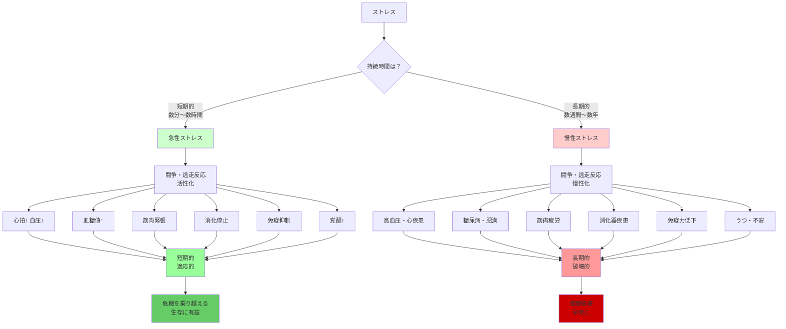
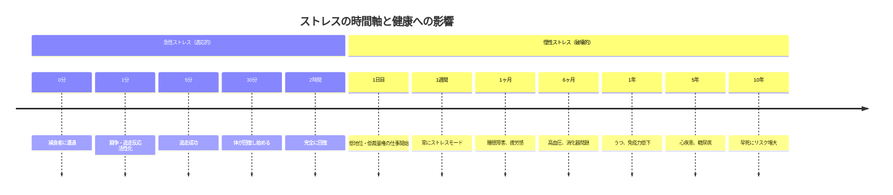

## 要約（Summary）

- 急性ストレス（短期的）は生物学的に有益で、生存に必要な適応反応を引き起こす
- 慢性ストレス（長期的）は有害で、闘争・逃走反応が日常的になると体を破壊する
- 問題は、特定の職場や生活様式で、短期的な緊急事態であるべきストレスが慢性的な状態になったこと

## 本文（Body）

### 背景・問題意識

スタンフォード大学の生物学者ロバート・サポルスキーは、ヒヒと人間の両方を調べていて、**ストレスがきわめて重要なツール**であることを発見した。体が適切に機能しているときには、ストレスは私たちの**助けになる**ような一連の生物学的変化を引き起こす。

しかし、現代社会では、ストレスの性質が変わってしまった。短期的な緊急事態に対応するための闘争・逃走反応が、慢性的な状態になり、体を蝕んでいる。

### アイデア・主張

#### 急性ストレス：生存のツール

**闘争・逃走反応（Fight-or-Flight Response）**：

短期的な危機（捕食者との遭遇、事故、緊急事態など）に直面したとき、体は自動的に以下の反応を起こす：

1. **心拍数と血圧の上昇**：筋肉に酸素を供給
2. **血糖値の上昇**：エネルギーを筋肉に供給
3. **筋肉の緊張**：素早く動けるように準備
4. **消化の停止**：エネルギーを筋肉に集中
5. **免疫系の一時的抑制**：エネルギーを緊急事態に集中
6. **注意力と覚醒の向上**：危険を察知し、素早く判断

**これは適応的で有益**：
- サバンナで捕食者に出くわしたとき、この反応が生存を可能にする
- 短期的な危機を乗り越えるための進化的に洗練されたメカニズム

#### 慢性ストレス：破壊のメカニズム

問題は、**闘争・逃走反応が一部の職場や生活様式では、短期的な緊急事態ではなく慢性的な状態になってしまった**点にある。

**恐ろしい捕食者に出くわすといった例外的な非常事態ではなく、特定の仕事の苛酷さのせいで、私たちはストレスモードに入る**。

たんに急性のストレスであるべきものが、今や私たちのあまりに多くにとっては**日常的なもの**になっているのだ。

**慢性ストレスの有害な影響**：

1. **心血管系への影響**：
   - 高血圧（常に血圧が高い状態）
   - 心疾患（心臓への負担が常に大きい）
   - 脳卒中のリスク増加

2. **代謝系への影響**：
   - 糖尿病（常に血糖値が高い）
   - 肥満（コルチゾールが脂肪蓄積を促進）
   - メタボリックシンドローム

3. **免疫系への影響**：
   - 免疫力低下（常に免疫が抑制される）
   - 感染症への脆弱性
   - 炎症反応の慢性化（がん、自己免疫疾患のリスク）

4. **精神への影響**：
   - うつ病（常に緊張状態）
   - 不安障害（過度な覚醒）
   - 認知機能の低下（記憶、判断力）

5. **その他の影響**：
   - 消化器系の問題（潰瘍、過敏性腸症候群）
   - 睡眠障害（常に覚醒状態）
   - 加齢の加速（テロメアの短縮）

#### 急性 vs 慢性の決定的な違い

| 特徴 | 急性ストレス | 慢性ストレス |
|------|-------------|-------------|
| 持続時間 | 短期的（数分〜数時間） | 長期的（数週間〜数年） |
| 発生頻度 | 稀（例外的な緊急事態） | 頻繁（日常的） |
| 生物学的効果 | 適応的・有益 | 破壊的・有害 |
| 体への影響 | 一時的な変化、回復可能 | 恒久的な損傷 |
| 例 | 捕食者からの逃走、事故 | 低地位・低裁量権の仕事 |

#### サポルスキーとマーモットの共通の主張

両者とも揃って主張しているのは、**闘争・逃走反応が一部の職場や生活様式では、短期的な緊急事態ではなく慢性的な状態になってしまった**点にある。

特に、**マーモットの研究が示すように、低い地位の職に就いていると、有害な生物学的ストレス反応を現に起こしてしまう**。

高い地位の職でも、**要求が厳しくて裁量権が少ないと、やはり同じ結果**が見られる。

### 内容を視覚化するMermaid図

### 具体例・ケース

**急性ストレスの例**：
- **スポーツ競技**：試合前の緊張、試合中のアドレナリン → 試合後に回復
- **プレゼン発表**：発表前の緊張 → 発表後にリラックス
- **締切前の追い込み**：1週間の集中作業 → 終了後に休息
- **交通事故の回避**：急ブレーキ → 数分後に落ち着く

これらは**短期的**で、**回復期間**があり、**適応的**。

**慢性ストレスの例**：
- **低地位・低裁量権の仕事**：毎日、上司からの厳しい要求、自分では決められない → 休日も緊張が解けない
- **経済的困窮**：毎月、家賃・食費の心配 → 常に不安
- **介護**：24時間、高齢の親の介護 → 休む暇がない
- **不安定な雇用**：いつ解雇されるか分からない → 常に緊張
- **虐待的な関係**：家庭内暴力、パワハラ → 常に恐怖

これらは**長期的**で、**回復期間がなく**、**破壊的**。

**職場での慢性ストレス**：
- **コールセンターのオペレーター**：1日中、クレーム対応、厳しいKPI、スクリプトに従うだけ
- **看護師**：長時間労働、患者の命を預かる責任、医師の指示に従うだけ
- **中間管理職**：上からの圧力、下からの要望、自分では決められない

**現代社会の問題**：
- サバンナでは、捕食者との遭遇は**稀**（週に数回）
- 現代の職場では、ストレス源は**日常的**（毎日8時間以上）
- 進化は急性ストレスに対応するよう設計されたが、慢性ストレスには対応していない

### 反論・限界・条件

**適度な急性ストレスは必要**：
- すべてのストレスを避けるべきではない
- 適度な急性ストレス（挑戦、成長、学習）は、レジリエンスを高める
- 「ストレスゼロ」は退屈で、成長がない

**個人差の存在**：
- 同じストレス源でも、個人によって急性か慢性かが異なる
- レジリエンス（回復力）、コーピングスキル（対処能力）が影響
- 遺伝的要因もある

**回復期間の重要性**：
- 慢性ストレスでも、十分な回復期間（休暇、睡眠、運動）があれば緩和される
- 問題は、回復期間がない状態

**慢性の定義の曖昧さ**：
- どこから「慢性」なのか（1ヶ月？6ヶ月？1年？）
- 頻度と強度の組み合わせで決まる

**ストレスの主観性**：
- 客観的なストレス源と、主観的に感じるストレスは異なる
- 認知的評価（脅威と捉えるか、挑戦と捉えるか）が影響

**社会的・経済的制約**：
- 「慢性ストレスを避けよ」と言われても、経済的に仕事を辞められない
- 介護、借金などで、ストレス源から逃げられない

## 関連ノート（Links）

- [[20251227101451-job-demand-control-health-model|職務要求度と裁量権の二軸モデル]] - 低裁量権が慢性ストレスを生む
- [[20251227101630-alpha-paradox-beta-position-optimal|アルファ・パラドックス]] - アルファの慢性的な権力闘争ストレス
- [[20251227101827-social-network-buffers-biological-stress|社会的ネットワークが生物学的ストレスを緩和するメカニズム]] - 慢性ストレスの緩和策
- [[20251227101314-power-changes-dopamine-receptors|社会的地位が脳のドーパミン受容体を変化させるメカニズム]] - 慢性的な低地位の生物学的影響

## To-Do / 次に考えること

- [ ] 自分の仕事で、急性ストレス（一時的な締切）と慢性ストレス（日常的なプレッシャー）を区別する
- [ ] 慢性ストレス源（低裁量権、長時間労働、不安定雇用）を特定し、改善策を考える
- [ ] 職場で、慢性ストレスを急性化する施策（明確な締切、プロジェクトベース、回復期間の確保）を導入
- [ ] 自分自身の回復期間（睡眠、運動、休暇、趣味）を意識的に確保する
- [ ] 慢性ストレスの兆候（睡眠障害、疲労感、高血圧、消化器問題）を観察し、早期に対策する
